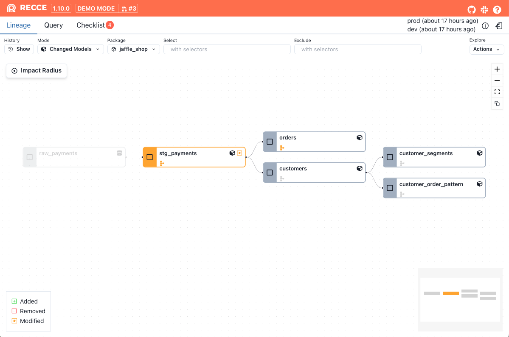
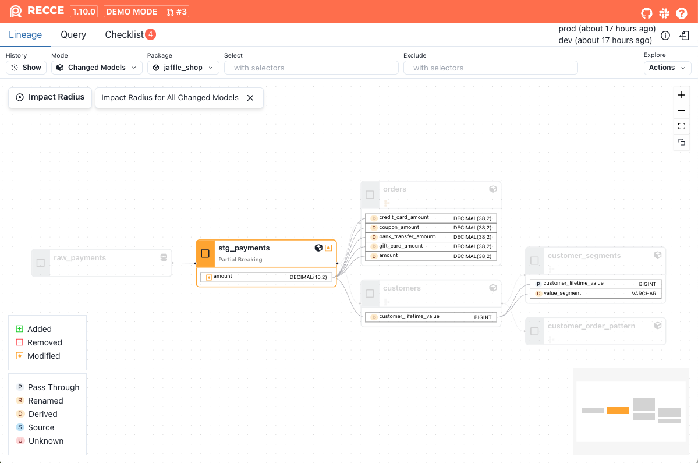
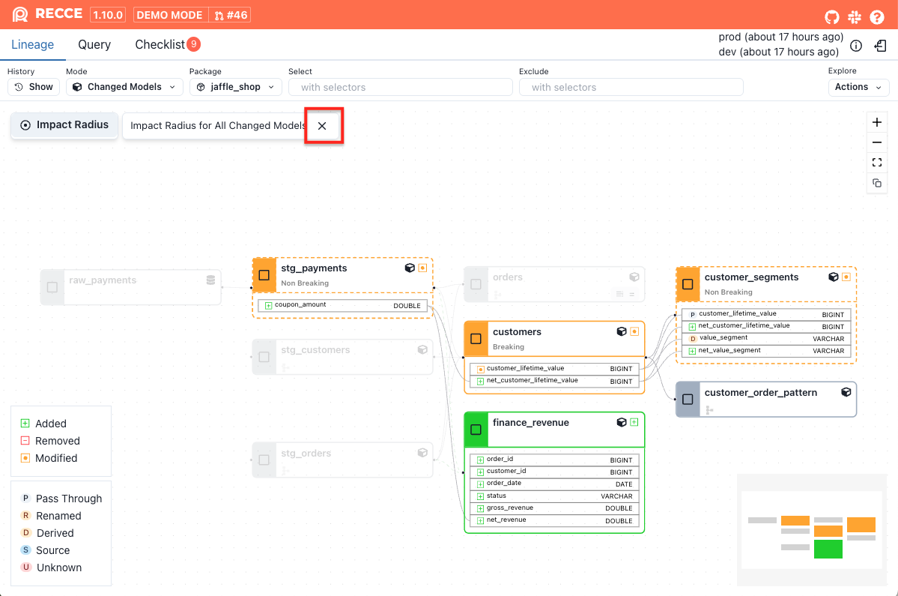
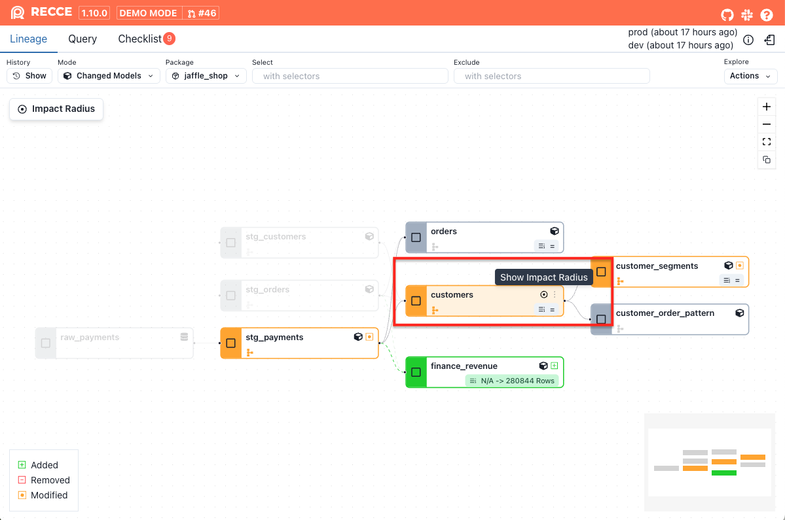
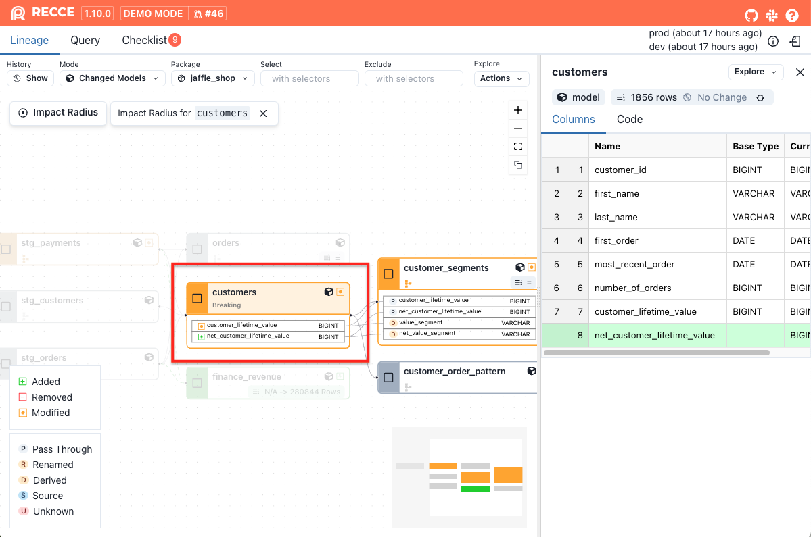
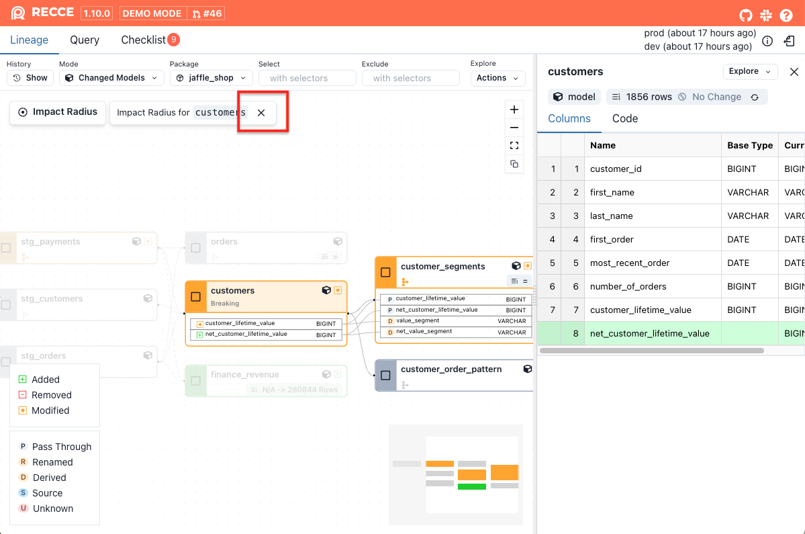

**Impact Radius** helps you analyze changes and identify downstream impacts at the column level.

While dbt provides a similar capability using the [state selector](https://docs.getdbt.com/reference/node-selection/methods#state) with `state:modified+` to identify modified nodes and their downstream dependencies, Recce goes further. By analyzing SQL code directly, Recce enables **fine-grained impact radius analysis**. It reveals how changes to specific columns can ripple through your data pipeline, helping you prioritize which models—and even which columns—deserve closer attention.

=== "state:modified+"
    
    {: .shadow}

=== "Impact Radius"
    
    {: .shadow}

## Usage

### Show impact radius

1. Click the **Impact Radius** button in the upper-left corner.

    {: .shadow}

1. The impact radius will be displayed.

    {: .shadow}

1. To exit impact radius view, click the close button in the upper-left corner.
    
    {: .shadow}

### Show impact radius for a single changed model

1. Hover over a changed model, then click the **target icon** or right-click the model and click the **Show Impact Radius**

    {: .shadow}

1. The impact radius for this model will be displayed.

    {: .shadow}

1. To exit impact radius view, click the close button in the upper-left corner.
    
    {: .shadow}

## How it works

Two core features power the impact radius analysis:

**[Breaking Change Analysis](./breaking-change-analysis.md)** classifies modified models into three categories:

- **Breaking changes**: All downstream nodes are impacted
- **Non-breaking changes**: No downstream nodes are impacted
- **Partial breaking changes**: Only downstream columns that depend on modified columns are impacted.

**[Column-level lineage](./column-level-lineage.md)** analyzes your model's SQL to identify column-level dependencies:

- Which upstream **columns** are used as filters or grouping keys. If those upstream **columns** change, the current **model** is impacted.
- Which upstream **columns** a specific column references. If those upstream **columns** change, the specific **column** is impacted.

## Putting It Together

With the insights from the two features above, Recce determines the impact radius:

1. If a model has a **breaking change**, include all downstream models in the impact radius.
1. If a model has a **non-breaking change**, include only the downstream columns and models of newly added columns.
1. If a model has a **partial breaking change**, include the downstream columns and models of added, removed, or modified columns.

