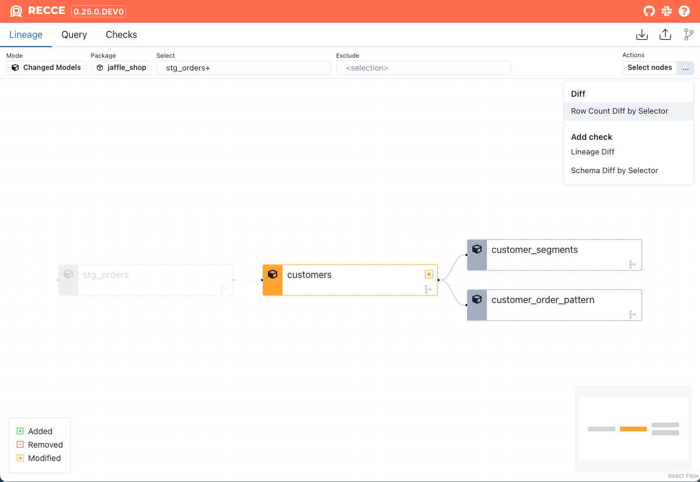

Recce supports dbt [node selection](https://docs.getdbt.com/reference/node-selection/syntax) in the [lineage diff](./lineage.md#lineage-diff). This enables you to target specific resources with data checks by selecting or excluding nodes.

## Supported syntax and methods

Since Recce uses dbt's built-in node selector, it supports most of the selecting methods. Here are some examples:

- Select a node: `my_model`
- select by tag: `tag:nightly`
- Select by wildcard: `customer*`
- Select by graph operators:  `my_model+`, `+my_model`, `+my_model`, `1+my_model+`
- Select by union: `model1 model2`
- Select by intersection: `stg_invoices+,stg_accounts+`
- Select by state: `state:modified`, `state:modified+`

### Use `state` method

In dbt, you need to specify the `--state` option in the CLI. In Recce, we use the base environment as the state, allowing you to use the selector on the fly.

### Removed nodes
Another difference is that in dbt, you cannot select removed nodes. However, in Recce, you can select removed nodes and also find them using the graph operator. This is a notable distinction from dbt's node selection capabilities.

## Supported Diff

In addition to lineage diff, other types of diff also support node selection. You can find these features in the **...** button in the top right corner. Currently supported diffs include:

- Lineage diff
- Row count diff
- Schema diff

{: .shadow}

## Limitation

- ["result" method](https://docs.getdbt.com/reference/node-selection/syntax#the-result-status) not supported
- ["source_status" method](https://docs.getdbt.com/reference/node-selection/syntax#the-source_status-status) not supported.
- [YAML selectors](https://docs.getdbt.com/reference/node-selection/yaml-selectors) not supported.
