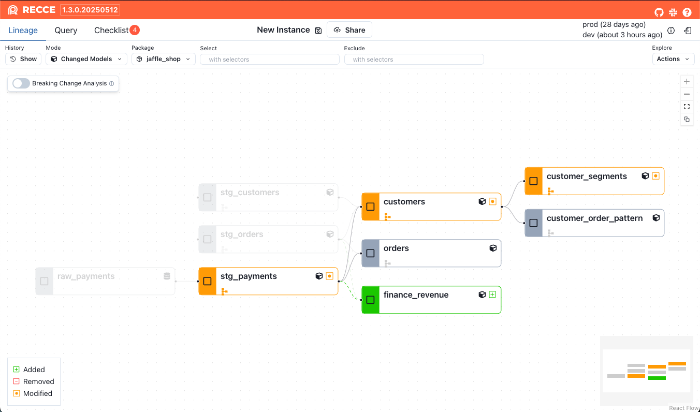
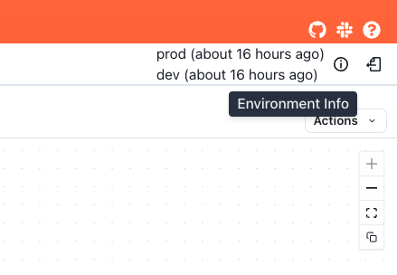

# Getting Started
This guide walks you through how to use Recce, whether you're exploring for the first time or expanding to Recce Cloud.

Use Recce to validate your data changes with clarity and confidence. Recce helps you:

- Explore what changed
- Validate downstream impacts
- Collaborate through shareable checklists

For a hands-on walkthrough, check out the [5 Minute Tutorial](./get-started-jaffle-shop.md).


## Start Recce with Two Commands

Navigate to your dbt project and run:
```shell
cd your-dbt-project/  # if you're not already there
pip install -U recce
recce server
```

Recce use dbt [artifacts](https://docs.getdbt.com/reference/artifacts/dbt-artifacts) generated with every invocation to understand your project’s and data. You can find these files in the `target/` folder.

| artifacts     | dbt command                        |
| ------------- | ---------------------------------- |
| manifest.json | `dbt docs generate`, `dbt run`, .. |
| catalog.json  | `dbt docs generate`                |

!!! tip

    The regeneration of the `catalog.json` file is not required after every `dbt run`. it is only required to regenerate this file when models or columns are added or updated.

## Get Instant Visibility

With just one environment, Recce gives you:

- **Lineage clarity**: Trace changes down to the column level

- **Query insights**: Explore logic and run custom queries

- **Live diffing**: Reload and inspect changes as you iterate

Perfect for early exploration, root cause analysis, and faster debugging before involving others.

<!-- <insert the gif of sign in flow step 2>  -->

## Unlock Diff & Validation with Two Environments
Not all data changes are obviously right or wrong, especially when business logic is involved. Even if your change pass all tests, it might still produce unexpected results. That’s why comparing **before and after** is critical: it helps you understand the impact of your change, validate with confidence, and spot issues before they reach stakeholders.

When you configure two environments (e.g. prod and dev), Recce lets you:

- **Explore** modified models and downstream impact

- **Validate** changes via diffs or custom queries

- Add validation results to **Checklists** for review and alignment


### How to Set Up Two Environments
Setup two separate [environments](https://docs.getdbt.com/docs/environments-in-dbt) that refers to different [schemas](https://docs.getdbt.com/docs/core/connect-data-platform/connection-profiles#understanding-target-schemas), e.g., prod for production and dev for development.

Recce supports all major data warehouses that [dbt supports](https://docs.getdbt.com/docs/supported-data-platforms), including Snowflake, Databricks, BigQuery, Redshift, and DuckDB. 

!!! tip

    No need to change your `profiles.yml`. Recce auto-discovers your dbt profile and runs everything in your current environment.

### Prepare dbt artifacts
Recce compares **metadata**, not just code. dbt generates [artifacts](https://docs.getdbt.com/reference/artifacts/dbt-artifacts) (like manifest, catalog..etc.) that describe your project’s structure and data characteristics.

To compare environments, Recce expects **two sets of dbt artifacts**:

- `target-base/` - the baseline environment (e.g. main or production)
- `target/` - the development environment (your current changes)

#### Generate Artifacts for the `base` Environment
For most data warehouses, you don’t need to re-run production locally.
Instead, you can download the dbt artifacts generated from the main branch, and save them to a `target-base/` folder.
This gives Recce the metadata it needs to compare your current development changes against the baseline, without querying production data.

#### Generate Artifacts for the `target` Environment
To generate artifacts for your current environment, run:

```shell
git checkout feature/my-awesome-feature

dbt run
dbt docs generate
```
By default, dbt will save the artifacts to the `target/` folder. Recce uses these to understand the current state of your project.

### All Set
Once you’ve configured both environments, launch Recce again:

```shell
recce server
```

You’ll be able to see modified lineage, explore model changes, and run detailed diffs across environments.


!!! tip
    1. Click **Environment Info** at the top-right corner to view the two environments you configured.
      
    2. Want to try Recce without setting up a warehouse? See the [5 Minute Tutorial](./get-started-jaffle-shop.md) using DuckDB to run Recce locally.

## Share to Collaborate 
If you’ve followed the steps above and are ready to share your checklist with others, Recce Cloud makes it easy.
Just one link gives full context:

- Lineage
- Diff results
- Checklist validation with comments

Built for teams, Recce Cloud includes secure, cloud-hosted sharing and collaboration features designed for fast reviews and confident sign-off.

[Sign up for Recce Cloud](https://cloud.datarecce.io/) to unlock collaboration at scale.