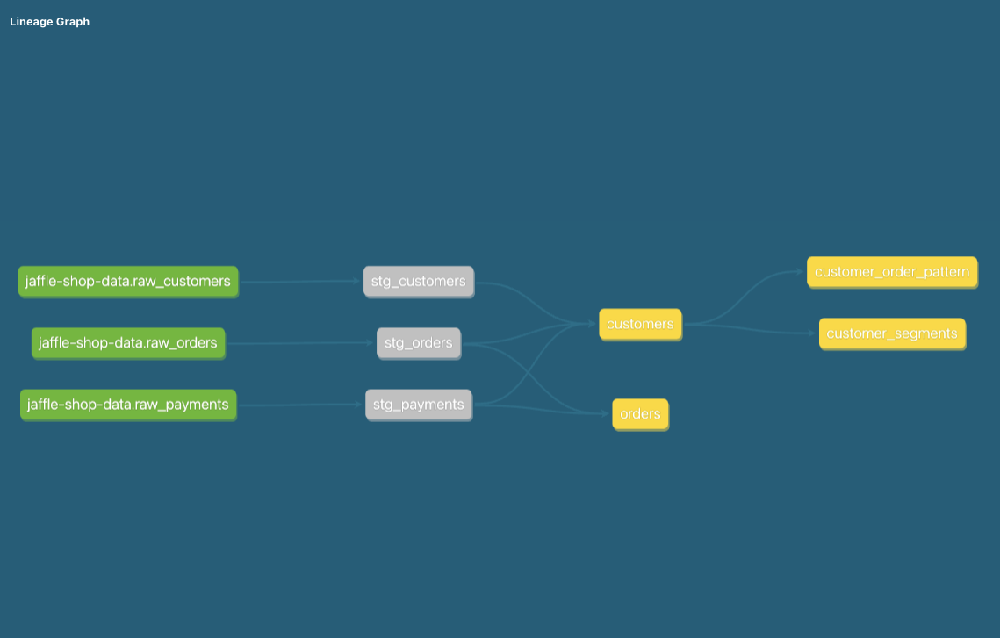
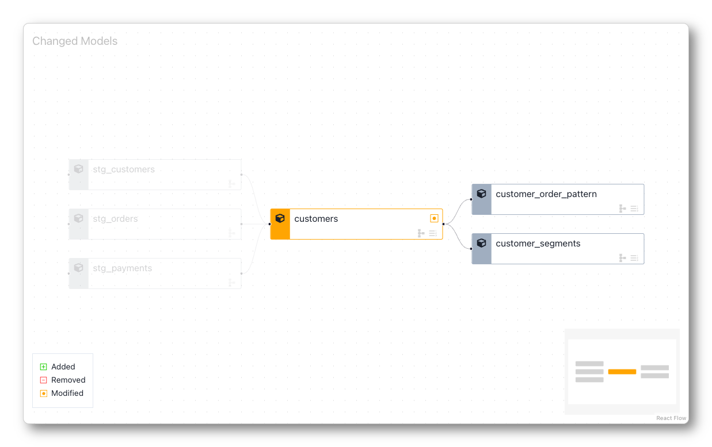
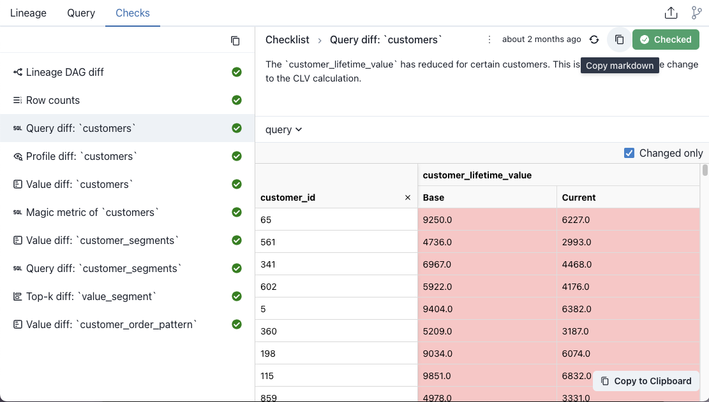
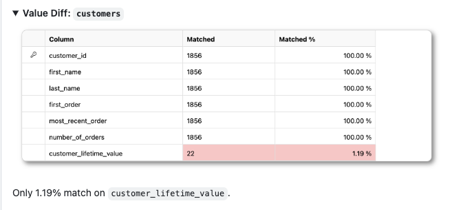

When you've finished developing your feature, we should turn the pull request (PR) into [ready for review](https://docs.github.com/en/pull-requests/collaborating-with-pull-requests/proposing-changes-to-your-work-with-pull-requests/changing-the-stage-of-a-pull-request) state. At this point, the PR submitter needs to provide the necessary information for the PR reviewer. Some projects may offer a PR template. In the dbt official blog, [this article](https://docs.getdbt.com/blog/analytics-pull-request-template) provides an excellent example.

Recce at this stage aims to assist the submitter in gathering more information to ensure that the reviewer can merge the pull request (PR) with greater confidence.

## Screenshots

### Lineage

Firstly, the Lineage DAG is crucial information within a dbt project as it helps us understand the dependencies between models. In dbt docs, it provides lineage diagrams. Usually, we can paste this diagram into the PR comment to help the reviewer understand the latest lineage status.

{: .shadow}

However, during PR reviews, we may be more interested in understanding what changes have been made and presenting them through the Lineage DAG. At this point, you can utilize recce to capture a screenshot of the Lineage diff and embed it within your PR comment.



### Checks


Another core feature of Recce is its various checks, which allow us to compare key models with the base environment. The typical workflow is as follows:

1. Generate the various diffs you need.
2. Identify the query and its result that you want to present to the reviewer.
3. Add it to the checklist.
4. Click the **Copy to Clipboard** button and paste it in the corresponding position within the PR comment.
5. Write a description of your check, including explanations and intentions.
6. Click the **Copy markdown** button
    {: .shadow}
7. paste it in the corresponding position within the PR comment.
    {: .shadow}


## Share the Recce File

If you want the reviewer to access your environment, you can also attach the [Recce state file](../features/state-file.md) to the PR comment.

**As a Submitter**

1. Save or export the recce state file
2. Attach the state file into the PR comment

**As a Reviewer**

1. Download the state file
2. In your dbt project folder, run this command
   ```
   recce server --review <recce state file>
   ```

By adding the `--review` option, the Recce server will use the DBT artifacts from the state file to connect to both the base and the pull request (PR) environments.


!!!Note
    
    Although the artifacts are from the Recce state, you still need to provide the `profiles.yml` and `dbt_project.yml` files so that Recce knows which credentials to use to connect to the data warehouse.


