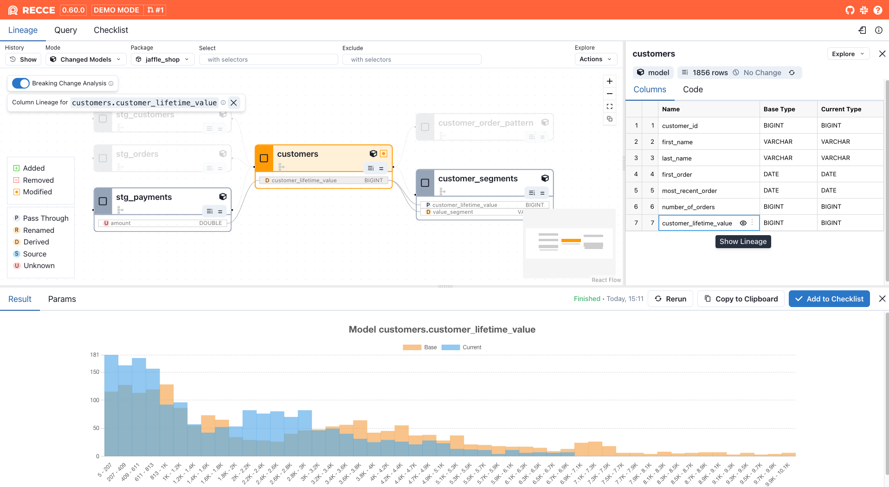
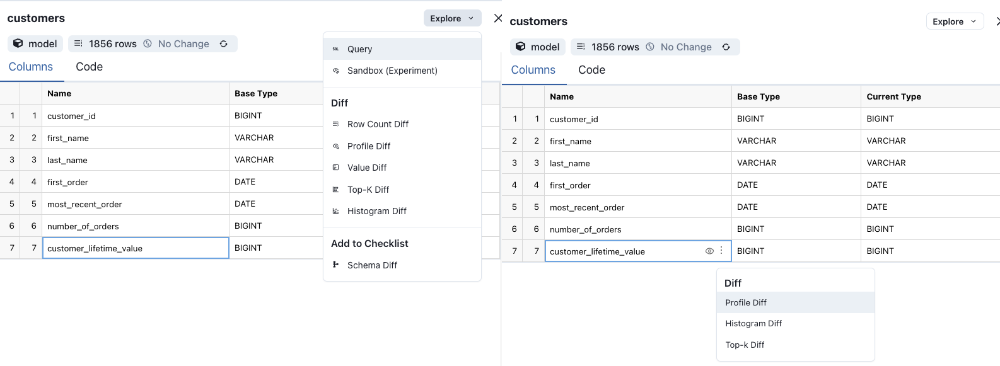
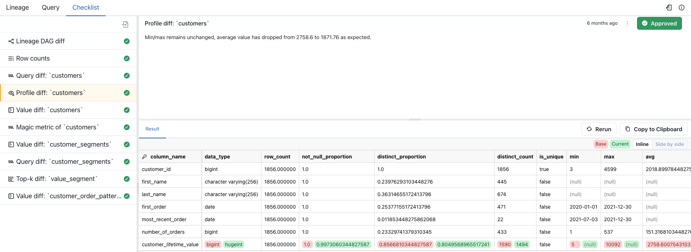

# What is Recce?

Recce (pronounced "wreck-E"), short of reconnaissance, helps data teams cut guesswork on downstream impact, streamline collaboration, and ship changes faster—building trust through clarity.

## Quick Start

You can launch Recce in any dbt project in just two commands:

```bash
# cd into your dbt project
pip install -U recce
recce server
```

This starts Recce locally, where you can explore lineage and run queries. To unlock the full set of diffing tools, such as data comparisons and impact checks, you’ll need to prepare two environments to compare against. You can follow our [5-minute Jaffle Shop tutorial](https://docs.reccehq.com/get-started-jaffle-shop/) to try it out step-by-step.

Recce is the foundation of the workflow. It helps you explore changes, validate before merge, and provide full context to reviewers and stakeholders. Once you're comfortable using it locally, you can explore advanced collaboration features through Recce Cloud.

<iframe src="https://www.loom.com/embed/77a85411dbd046bf802d7786b2d47bf5?sid=40245a99-03d7-4687-b5fb-3d509489fc3b" frameborder="0" webkitallowfullscreen mozallowfullscreen allowfullscreen style="width: 100%; height: 500px;"></iframe>

### Explore the Live Demos

Want to see Recce in action without setting anything up? Check out the [interactive demos](https://reccehq.com/demo/). 

## Why Recce

[dbt](https://www.getdbt.com/) introduced software best practices to data projects: modular SQL, version-controlled code, and reproducible pipelines.

But “bad merges” still happen. Silent data errors slip through. Trust breaks when the metrics break.

As teams scale and more people contribute to data projects, it becomes harder to validate changes with confidence, especially when the impact spans multiple models or business domains.

Recce brings data reconnaissance into the workflow. Instead of hoping everything’s fine, you can:

- Instantly trace dependencies down to the column level
- Compare data and metrics before and after a change
- Share a clear, explainable checklist with teammates and stakeholders

The only way to know the impact of a change is to compare what it actually changes. Recce makes that fast, visible, and collaborative.

## Who is Recce for?

Recce helps teams catch issues early, understand the impact of changes, and build trust in every deployment. It fits naturally into the data workflow so validation becomes part of how you build, not something extra to worry about.

- **Data engineers** use Recce to check for downstream impact and make sure changes are safe before merging.
- **Analysts** use Recce to review their own work, compare data before and after, and confirm that key metrics still make sense.
- **Stakeholders** use Recce to review updates with clear context, without reading SQL or digging into warehouse tables.

## What You Get

Recce gives you a clear, fast way to understand what your data changes are doing and why they matter. It helps you catch problems early, verify metrics, and share your findings with others, all as part of your normal workflow.



Lineage graph supports model/column levels navigation and breaking change analysis.



Model and column level diff



Checklist for collaboration

### What’s included

- **Lineage and impact mapping:** Quickly see which models and columns are affected by a change. Navigate lineage down to the column level, and spot breaking changes with clear visual cues.
- **Metric and data comparisons:** Use Profile, Value, Top-K, and Histogram Diffs to compare results before and after changes. Validate things like row counts, category distributions, and numeric ranges without writing extra SQL.
- **Query diff:** Write and compare any two queries side by side. This is helpful when validating fixes or reviewing changes with teammates.
- **Checklist for reviews and approvals:** Turn your validation steps into a checklist. Add notes, rerun checks, and share the results with reviewers or stakeholders. In Recce Cloud, checklists can sync automatically and even block PRs until checks are approved.
- **Secure by design:** Recce is SOC 2 compliant to meet enterprise security standards. It runs locally or in your private environment, and your data stays in your warehouse.

### Learn More

Want to dive deeper? Check out the full documentation for setup guides, feature overviews, and use case tutorials.

- [Getting Started](https://docs.reccehq.com/get-started/)
- [Features Overview](https://docs.reccehq.com/features/lineage/)
- [Writing Checks and Using Checklists](https://docs.reccehq.com/features/checklist/)
- [State File and Configuration](https://docs.reccehq.com/features/state-file/)
- [Running Recce in CI/CD](https://docs.reccehq.com/guides/scenario-ci/)
- [Breaking Change Analysis](https://docs.reccehq.com/features/breaking-change-analysis/)

## Recce Cloud

Ready to collaborate and move faster as a team? Recce Cloud adds real-time collaboration, automatic checklist sync, and PR gating, so nothing gets merged without a full review.

- Share checklists across environments
- Invite stakeholders to review data changes
- Block merges until all Checks are approved
- Launch demo links from your CI with full context

👉 [View Pricing and Plans](https://reccehq.com/pricing)

Recce Cloud is a hosted version of Recce that standardizes your workflow, keeps teams aligned, and reduces errors—so you can ship data changes with confidence.

## Community & Support

Here's where you can get in touch with the Recce team and find support:

- [Our discord](https://discord.com/invite/VpwXRC34jz)
- [dbt Slack](https://www.getdbt.com/community/join-the-community) in the [#tools-recce](https://getdbt.slack.com/archives/C05C28V7CPP) channel
- Email us [help@reccehq.com](mailto:help@reccehq.com)

If you believe you have found a bug, or there is some missing functionality in Recce, please open a [GitHub Issue](https://github.com/DataRecce/recce/issues).

## Recce on the web

You can follow along with news about Recce and blogs from our team in the following places:

- [reccehq.com](https://reccehq.com/)
- [LinkedIn](https://www.linkedin.com/company/datarecce)
- [Recce Blog](https://blog.reccehq.com/)
- [@datarecce](https://x.com/DataRecce) on Twitter/X
- [@DataRecce@mastodon.social](https://mastodon.social/@DataRecce) on Mastodon
- [@datarecce.bsky.social](https://bsky.app/profile/datarecce.bsky.social) on BlueSky
