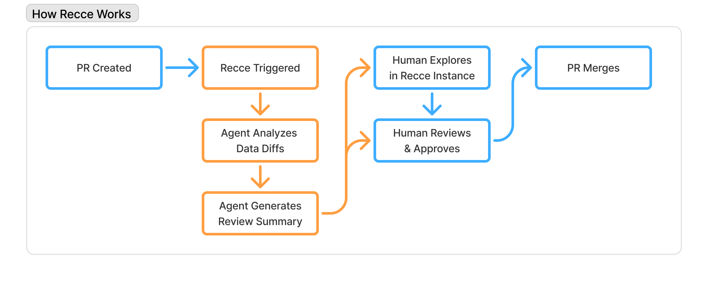

# What is Recce

Recce helps data teams catch data changes and their downstream impacts before they reach production.

**The problem:** Data pipelines succeed but data is quietly wrong. PRs merge without anyone checking what actually changed in the data. Junior and senior engineers apply different standards. Validation knowledge stays in people's heads instead of becoming team practice.

**The solution:** Recce provides a validation engine plus an AI agent that reviews your PRs automatically. The engine compares environments and visualizes impact. The agent runs validation, surfaces what changed, and explains why it matters—before you even look at the PR.

[**Get Started with Cloud**](getting-started/start-free-with-cloud.md){ .md-button .md-button--primary }
[**Set Up Open Source**](getting-started/oss-setup.md){ .md-button }

---

## How Recce Works

1. **Validation Engine:** Compares base (production) vs. current (development) environments and visualizes differences
2. **Data Review Agent:** Automatically validates PRs, runs data diffs, and posts a summary explaining changes and their impact

**Access via:**

| Method | Description |
|--------|-------------|
| **Cloud** | Full product: Validation engine + Data Review Agent + Collaboration. Includes `recce-cloud` CLI. |
| **OSS** | Validation engine only. No Agent. No collaboration. Includes `recce` CLI. |
| **MCP** | Use Recce OSS via AI agents (Claude Code, Cursor, Windsurf) with natural language. |

---

## What Makes Recce Different

### Column-level impact radius

Validate only the columns affected by your change, not entire models.

When you modify a column, Recce traces its downstream dependencies using Column-Level Lineage (CLL). You see exactly which columns in which models are impacted. This means:

- Targeted validation instead of full-table comparisons
- Faster reviews with less noise
- Clear understanding of change propagation

### Agent as reviewer zero

The agent validates first so you can focus on judgment.

Instead of manually checking what changed, the agent:

- Runs data diffs automatically when PRs open
- Surfaces schema changes, row count differences, and data anomalies
- Identifies unknown unknowns you might miss
- Provides a summary explaining what changed and why it matters

You review the agent's findings and decide what needs attention.

### Collaborate and standardize

Turn individual checks into team standards.

**Checks:** Save validation results to a checklist. Add descriptions explaining what reviewers should verify. Share with your team.

**Preset checks:** Promote recurring checks to run automatically on every PR. New team members apply the same validation standards as senior engineers.

---

## When to Use Recce

- **Business-critical data:** Customer-facing or revenue-impacting pipelines where errors cost money
- **Team collaboration:** When reviewers need to understand data impact, not just code changes
- **Consistent standards:** When junior and senior engineers should apply the same validation rigor
- **Unknown unknowns:** When you can't predict what might break from a change

## When Not to Use

- Teams that accept production errors and fix later
- Exploratory analysis that won't reach production

---

## FAQ

**What data platforms does Recce support?**

Recce works with Snowflake, BigQuery, Redshift, Databricks, and other dbt-supported warehouses. See [Connect to Warehouse](setup-guides/connect-to-warehouse.md).

**Does Recce work without CI/CD?**

Yes. Run Recce locally during development or in review sessions. CI/CD unlocks automated validation on every PR.

**What's the difference between Cloud and OSS?**

Cloud provides hosted infrastructure, automated PR integration, and the AI agent. OSS gives you the core validation engine to run yourself. See [Cloud vs OSS](whats-recce/cloud-vs-oss.md).

---

## Next Steps

- [Interactive Demo](https://reccehq.com/demo/) - Try the Data Review Agent
- [Get Started with Cloud](getting-started/start-free-with-cloud.md) - Automated PR validation
- [OSS Setup](getting-started/oss-setup.md) - Self-hosted validation
- [Blog: The Problem with Data PR Reviews](https://blog.reccehq.com/guided-data-review) - Why data validation matters
