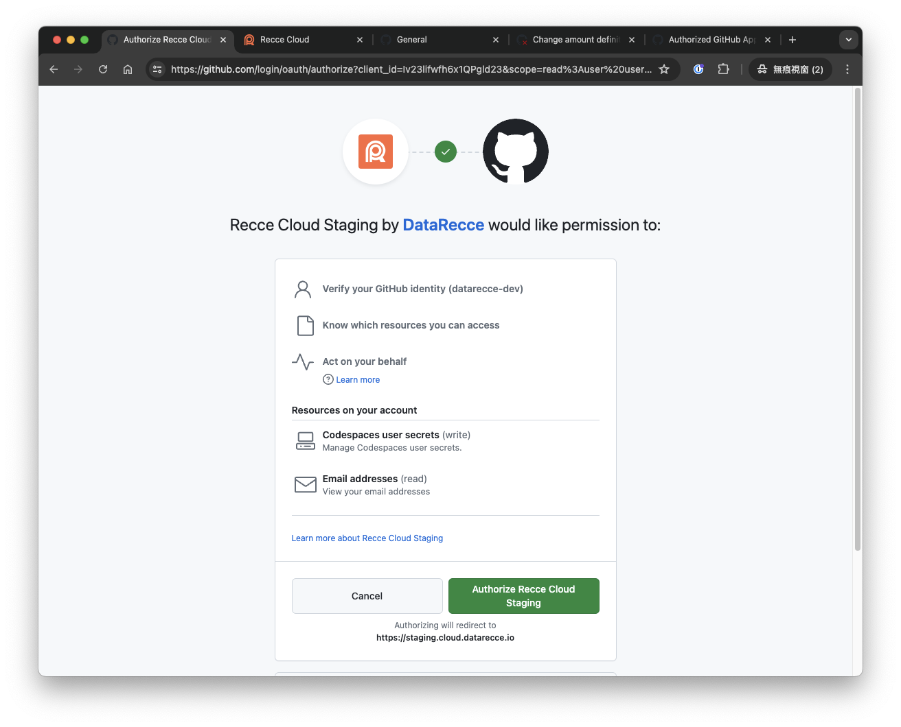
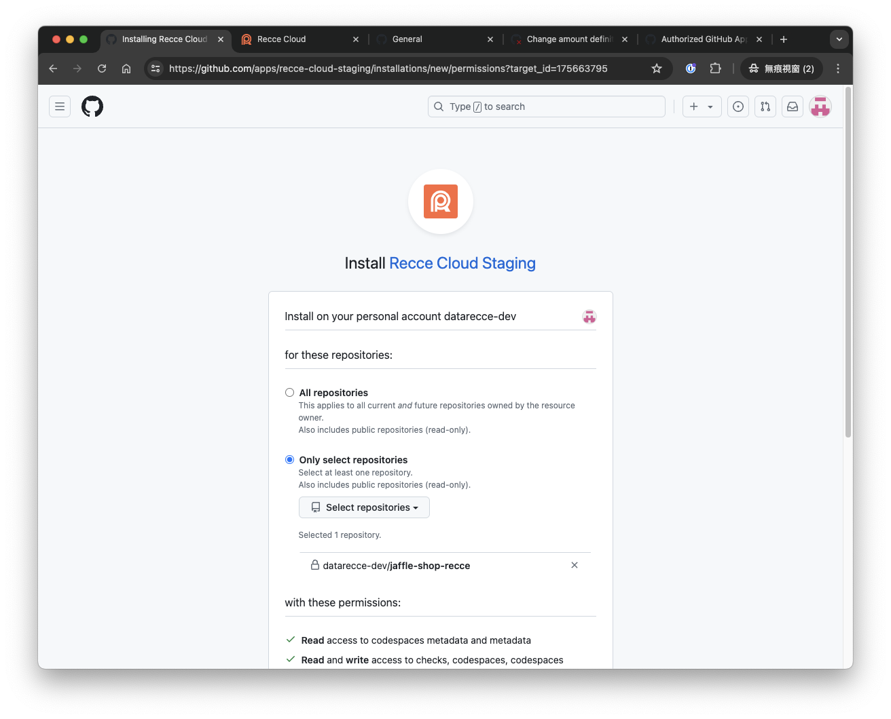
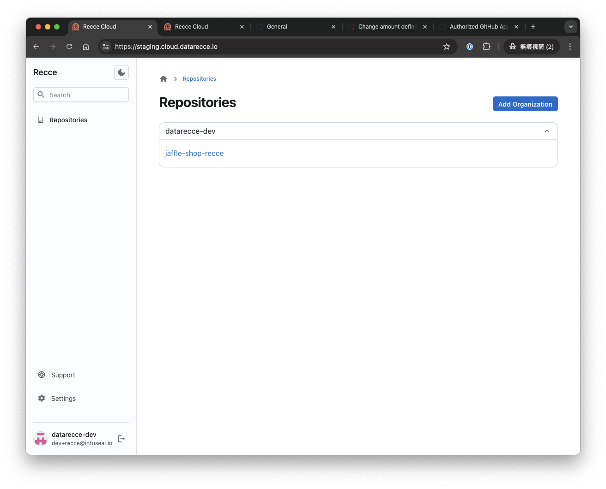
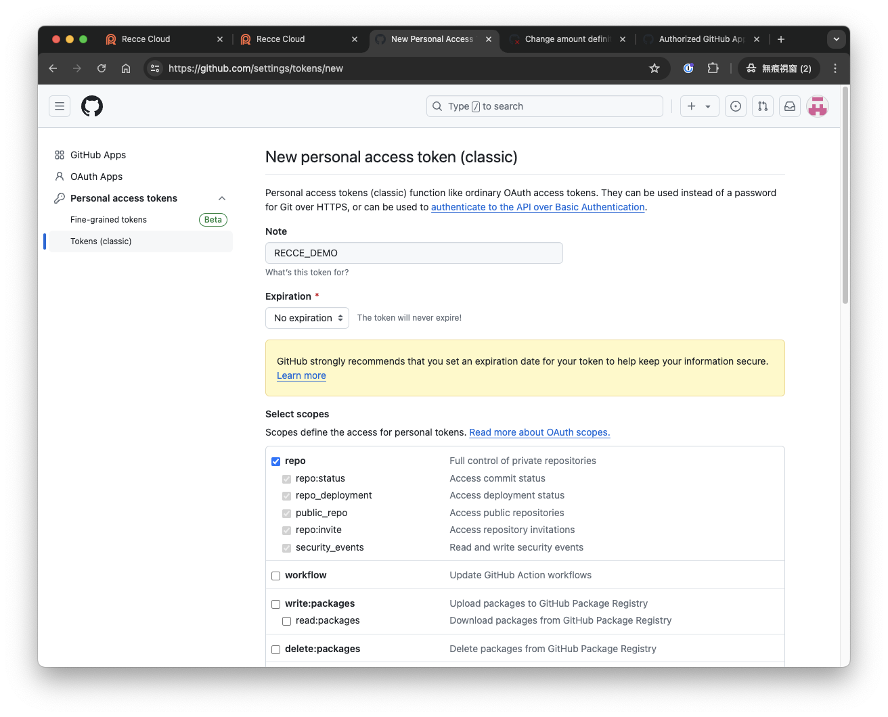
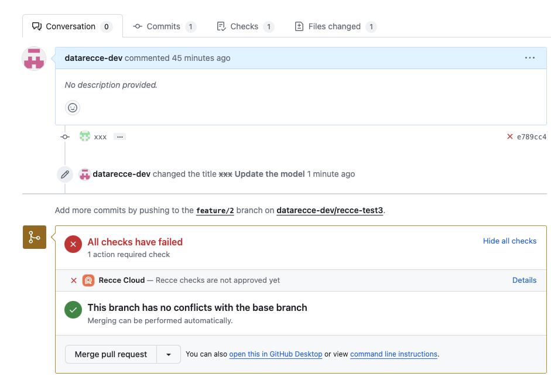
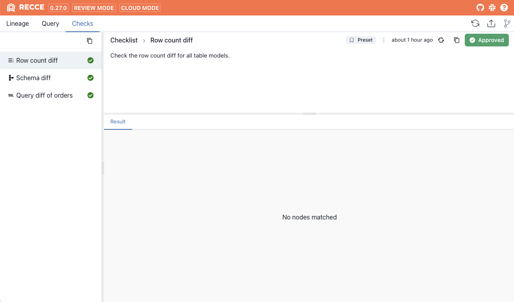

**Estimated Time:** 20 minutes

!!! Note
    Recce Cloud is currently in beta. [Learn more about different plans](https://datarecce.io/pricing).

The following guide uses the official [Jaffle Shop DuckDB](https://github.com/dbt-labs/jaffle_shop_duckdb) project from dbt-labs, and provides everything you need to get started with Recce Cloud. By the end of the guide you'll be able to create and sync Recce checks with a GitHub PR via Recce Cloud.

To see what you'll get, check out the first section from the following [Loom](https://www.loom.com/share/2029a2d63e61426fa16137f58575cea4?sid=ea4bcbd2-5ba8-4cbb-8617-3ddd97476b4b):


<div style="position: relative; padding-bottom: 62.19806763285024%; height: 0;"><iframe src="https://www.loom.com/embed/2029a2d63e61426fa16137f58575cea4?sid=5fd2f55d-f744-42a5-b11d-295cd9f43799" frameborder="0" webkitallowfullscreen mozallowfullscreen allowfullscreen style="position: absolute; top: 0; left: 0; width: 100%; height: 100%;"></iframe></div>


## Clone Jaffle Shop to your own private repository

1. [Create a **private** repository](https://github.com/new) in your GitHub account.
1. Clone the [Jaffle Shop DuckDB](https://github.com/dbt-labs/jaffle_shop_duckdb) dbt data project:
   ```shell
   git clone git@github.com:dbt-labs/jaffle_shop_duckdb.git
   cd jaffle_shop_duckdb
   ```
1. Change the remote url to the repository you just created:
   ```
   git remote set-url origin git@github.com:<owner>/<repo>.git
   ```
1. Push to your newly created repository:
   ```
   git push
   ```

## Authorize Recce Cloud to access the repository

Recce Cloud needs access to your data project's repository in order to sync your checks status to the pull request thread.

1. Visit [Recce Cloud](https://cloud.datarecce.io/). If it is your first time logging in, click the **Continue with Github** button to authorize the Recce Cloud integration to access your GitHub account.
   
   
1. Click the **Install** button to install the **Recce Cloud** GitHub app to your personal or organization account.
   
1. On the app installation page, authorize Recce Cloud to access the repository you created in the previous section.
   
1. Authorized repositories will then be shown in your Recce Cloud account.
   


## Configure the Jaffle Shop DuckDB data project

Set up the Jaffle Shop project and install Recce.

1. Create a new Python virtual env:
   ```shell
   python -m venv venv
   source venv/bin/activate
   ```
1. Install the requirements and Recce:
   ```shell
   pip install -r requirements.txt
   pip install recce
   ```
1. Add a production environment to the project by editing `./profiles.yml` and adding the following target:
   ```diff
   jaffle_shop:
     target: dev
     outputs:
       dev:
         type: duckdb
         path: 'jaffle_shop.duckdb'
         threads: 24
   +   prod:
   +     type: duckdb
   +     path: 'jaffle_shop.duckdb'
   +     schema: prod
   +     threads: 24
   ```

## Prepare the base environment

Recce requires to two environments to compare. The `base` represents your point of reference (the known-good base), and `target` represents your PR/development branch.

1. Prepare production (base) environment. (Note the custom `--target-path`):
   ```shell
   dbt seed --target prod
   dbt run --target prod
   dbt docs generate --target prod --target-path ./target-base
   ```
2. Add the `target-base/` folder to the `.gitignore` file:
   ```diff
    target/
   +target-base/
    dbt_packages/
    dbt_modules/
    logs/
   ```
3. Remove the existing GitHub action workflows:
   ```
   rm -rf .github/
   ```
4. Push the changes to remote:
   ```
   git add .
   git commit -m 'Configure project and prep for Recce'
   git push 
   ```

!!! Important

      By default, Recce expects the dbt artifacts for the base environment to be located in a folder named `target-base`. 

The base environment preparation is now complete. The data in the `prod` schema, and artifacts in the `target-base` folder, represent stable (production) data. 

As a PR author, you'll be working on data models, making changes to the project, and validating your work for correctness. 

## Prepare the review state for the PR

In this section, you'll make a new branch, update a data model, and create a pull request.

1. Checkout a branch:
   ```
   git checkout -b feature/recce-getting-started
   ```

1. Edit the staging model located in `./models/staging/stg_payments.sql` as follows:
   ```diff
   ...

   renamed as (
            payment_method,

   -        -- `amount` is currently stored in cents, so we convert it to dollars
   -        amount / 100 as amount
   +        amount

            from source
   )
   ```
1. 
   Run dbt on the development environment (the default target):
   ```shell
   dbt seed
   dbt run
   dbt docs generate
   ```

1. Commit the change:
   ```
   git add models/staging/stg_payments.sql
   git commit -m 'Update the model'
   git push -u origin feature/recce-getting-started 
   ```

1. **Create a pull request for this branch** in your GitHub repository.

!!! Important

      Don't forget to create a branch for the commit above, before continuing with this tutorial. 

## Launch a Recce Instance to validate your change

In this section, you will launch a Recce Instance, create validation checks, and sync those checks with Recce Cloud so they can be reviewed by your PR reviewer.

### Prepare a GitHub Token and Recce State password
To access the repository, your local Recce Instance will require a GitHub Token (Classic).

1. Prepare a [GitHub Token (Classic)](https://github.com/settings/tokens) in your account. Ensure you provide `repo` permission for the new token.
   
1. Ensure you have configured these environment variables.
   ```shell
   export GITHUB_TOKEN=<github-token>
   export RECCE_STATE_PASSWORD=mypassword
   ```

### Run Recce in Cloud Mode
Run Recce instance in the cloud mode

```
recce server --cloud
```

Open the link to the Recce Instance in your browser. By default it should be [http://0.0.0.0:8000](http://0.0.0.0:8000)


### Create a Recce Check
Switch to the **Query** tab and paste the following query:
   ```sql
   select * from {{ ref("orders") }} order by 1
   ```
   Enter the primary key as `order_id` and click the `Run Diff` button.
   {: .shadow}
1. Click the `Add to Checklist` button to add the query result to your Checklist
2. On the `Checklist` page you'll find that there are three checks. The Row count diff and Schema diff are default [Preset Checks](https://docs.datarecce.io/features/preset-checks/), and the Query diff is your newly added check. Leave the checks as **unapproved**.
3. Go back to the command line and terminate the Recce instance. Your Recce [State file](../features/state-file.md), containing your checklist and other artifacts will be encrypted and uploaded to Recce Cloud.
4. Go to the PR page in your GitHub repository and scroll to the bottom.  Notice that Recce Cloud shows that check are not approved:
   {: .shadow}


!!! Note

    Recce checks sync in realtime. However, due to the overhead of encrypting, compressing, and tranferring the State file, the sync may be slightly delayed. Ensure that you always terminate your Recce Instance on the CLI, and wait for the State to be synced. This will ensure your checks are saved to Recce Cloud.

## Review the PR

As a PR author, your job is to review and approve the Checks created by the PR author. Once approved, the PR can be merged. 

!!! Note

    As this tutorial uses DuckDB, which is a file-based database, the reviewer needs to have the same DuckDB file to continue the reviewers journey.

### Run Recce is `Review` mode

The PR reviewer should prepare their own GitHub token, but ensure to use the same password as the PR author. (The password is used to unencrypt the State file and so must be the same.)

1. Checkout the PR branch
   ```
   git checkout feature/recce-getting-started
   ```
1. Configured the required environment variables.
   ```shell
   export GITHUB_TOKEN=<github-token>
   export RECCE_STATE_PASSWORD=mypassword
   ```
1. Run Recce in `--cloud` and `--review` mode.
   ```
   recce server --cloud --review
   ```

### Approve Recce Checks

When Recce loads, click the Checklist tab to review the Checks that have been prepared by the PR author.

Approve all the checks if everything looks good to you

{: .shadow}

**The approval status of the check is automatically synced to Recce Cloud.**

### Merge the PR
Back on the GitHub PR page, you'll notice that the Recce Cloud check status has automatically been updated showing that "All checks are approved".

   {: .shadow}


In a real-world situation you'd now be able to merge the PR with the confidence that the PR author had checked their work, and the reviewer both understands and has signed-off on any changes.
