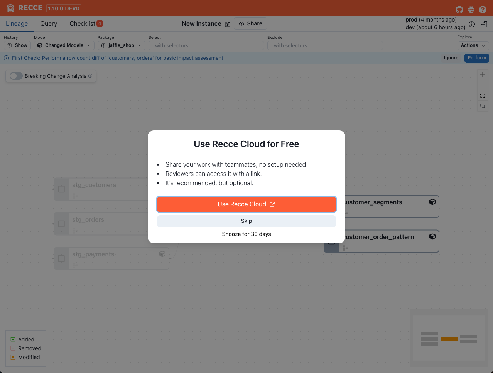
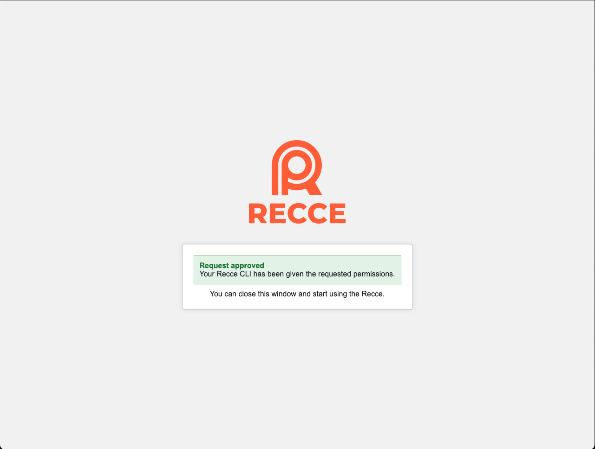
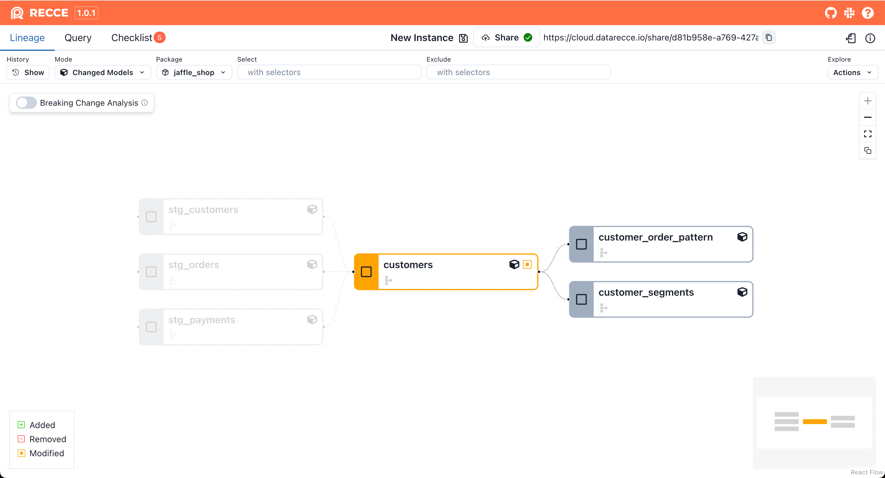
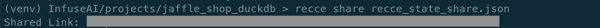

## Share your validation results with anyone, no setup needed

If you've already used Recce to validate your PR and prepared checks, but stakeholders might not have the environment to run Recce.

Recce Cloud allows you to share your Recce validation results with full context, using a simple link. Stakeholders can open a read-only Recce view directly in their browser. No installation, no configuration, just instant access.

!!! Note

    Please note that anyone with the link can visit your shared Recce after sign in Recce Cloud. If you need to restrict access, [please contact us](https://cal.com/team/recce/chat).

## How to use

When you're ready to share your lineage exploration, query results, or validation checklist, simply click **Share** in Recce.

The first time you do this, you'll need to associate your local Recce to Recce Cloud. This requires signing in and setting the association of local Recce. Once associated, Recce Cloud will host your state file securely, allowing you to share a link that others can open in their browsers.
`
### 1. Enable Recce Sharing

To start sharing, launch Recce server and click the **Use Recce Cloud** button if you are not associating Recce with Recce Cloud before.

{: .shadow}

### 2. Sign in to Recce Cloud and grand access permission

Once your login is successful, your local Recce will be prompted to grant access to Recce Cloud. This step is crucial for enabling the sharing functionality.

{: .shadow}

### 3. Refresh the page
After granting access, you need to refresh the Recce page. This will ensure that your local Recce is now associated with Recce Cloud and ready for sharing. You'll see the **Share** button, then you can click it to get the link on top.

{: .shadow}

!!! info
    **Note:** If you haven't wanted to start the Recce Server, you can also use the `recce connect-to-cloud` command to associate your local Recce to Recce Cloud. This command will prompt you to sign in and grant access permission.

    ```bash
    recce connect-to-cloud
    ```


## Configure recce cloud association manually
If you prefer to set up the Recce Cloud association manually, or you are running Recce under the container environment, you can do so by following these steps:

### 1. Sign in to Recce Cloud and retrieve your API token

Copy your API token from the [personal settings page](https://cloud.reccehq.com/settings#tokens) in Recce Cloud.

{: .shadow}


### 2. Configure your local Recce to use Recce Cloud
You can launch Recce server with the `--api-token` flag to associate with Recce Cloud. Once the token is set, your api token will be saved in your `~/.recce/profile.yml` file, and you won't need to set it again.

```bash
recce server --api-token <your_api_token>
```

Or you can modify your `~/.recce/profile.yml` file by text editor to include your Recce Cloud API token:

```yaml
api_token: <your_api_token>
```

!!! info
    **For Mac/Linux users:** In the terminal, type the following command to navigate to the Recce configuration directory:
    ```shell
    cd ~/.recce
    ```
    **For Windows users:** Navigate to `C:\Users\<your_user_name>` and open the hidden `.recce` folder.

    Or in PowerShell, type:
    ```powershell
    cd ~\.recce
    ```


## Share Recce state file from CLI

You can also use the `recce share` command. If you already have a prepared Recce state file, you can obtain a share link directly through the command line.
```bash
recce share <your_state_file>
recce share --api-token <your_api_token> <your_state_file> # if you are not associating Recce with Recce Cloud before
```
{: .shadow}
