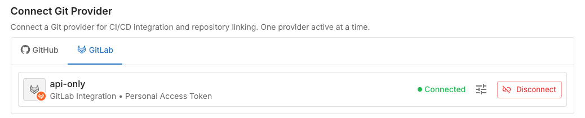
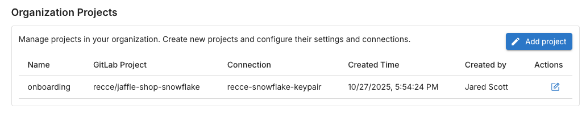

# Connect Your Repository

**Goal:** Connect your GitHub or GitLab repository to Recce Cloud for automated PR data review.

Cloud supports GitHub and GitLab. Using a different provider? Contact us at support@reccehq.com.

## Prerequisites

- [x] Cloud account (free trial at cloud.reccehq.com)
- [x] Repository admin access (required to authorize app installation)
- [x] dbt project in the repository

## How It Works

When you connect a Git provider, Cloud maps your setup:

| Git Provider | Cloud |
|--------------|-------------|
| Organization | Organization |
| Repository | Project |

Every Cloud account starts with one organization and one project. When you connect your Git provider, you select which organization and repository to link.

**Monorepo support:** If you have multiple dbt projects in one repository, you can create multiple Cloud projects that connect to the same repo.

## Connect GitHub

### 1. Authorize the Recce GitHub App

Navigate to Settings → Git Provider in Cloud. Click **Connect GitHub**.

**Expected result:** GitHub authorization page opens.

### 2. Select Organization and Repository

Choose which GitHub organization to connect. This becomes your Cloud organization.

Then select the repository containing your dbt project. This becomes your Cloud project.

**Expected result:** Repository connected. Your Cloud project is ready to use.

{: .shadow}

## Connect GitLab

GitLab uses Personal Access Tokens (PAT) instead of OAuth. Unlike GitHub, where the Recce GitHub App posts comments as itself, GitLab API comments appear as the token owner. We recommend creating a dedicated service account so that PR comments appear as a bot rather than your personal account.

!!! tip "Use a shared team email"
    When creating the service account, use a shared team email (e.g., `data@yourcompany.com`) so it isn't tied to any individual.

### 1. Create a Dedicated Service Account (Recommended)

If you use your personal token, your teammates see PR comments from *you* rather than from Recce Cloud. To avoid this, create a **GitLab service account** for Recce Cloud:

1. In GitLab, navigate to your **group → Settings → Service Accounts**
2. Click **Add service account**
3. Set the name to **Recce Cloud** (username auto-generates)
4. Click **Create service account**
5. (Optional) Edit the account to customize the username and upload a Recce avatar

**Expected result:** Service account appears in the group's member list with a "service account" badge.

Add the service account as a **Developer** member to the projects you want Recce Cloud to access.

!!! info "Availability"
    GitLab service accounts are available on GitLab.com Free (up to 100 per group), Premium, and Ultimate. For Self-Managed Free instances where service accounts are unavailable, create a dedicated GitLab user (e.g., `recce-cloud-bot`) instead.

If you don't have group admin access, you can skip this step and use a personal access token directly. Note that PR comments will appear as your user account.

### 2. Create a Personal Access Token

Generate a PAT for the service account (or your personal account if you skipped Step 1):

1. For a **service account**: navigate to your **group → Settings → Service Accounts**, select the account, and click **Create token**
2. For a **personal token**: navigate to **User Settings → Access Tokens → Add new token**
3. Set a descriptive name (e.g., "Recce Cloud integration")
4. Select the **`api`** scope (required for posting PR comments). The `read_api` scope is not sufficient.
5. Set an expiration date and click **Create**
6. Copy the token immediately (it cannot be viewed again)

### 3. Add Token to Cloud

Navigate to **Settings → Git Provider** in Recce Cloud. Select GitLab and paste the token.

## Verify Success

In Cloud, navigate to your repository. You should see:

- Connection status: "Connected"
- Organization Project is linked to a git repository

{: .shadow}
{: .shadow}

## Troubleshooting

| Issue | Solution |
| --- | --- |
| Repository not found | Ensure proper permissions are granted (GitLab: token access, GitHub: app authorized) |
| Invalid token (GitLab) | Generate new token with `api` scope |
| Cannot post PR comments (GitLab) | Regenerate token with `api` scope instead of `read_api` |
| PR comments show as personal user (GitLab) | Create a [service account](#1-create-a-dedicated-service-account-recommended) and use its token instead of your personal token |

## Next Steps

- [Connect Data Warehouse](connect-to-warehouse.md)
- [Add Recce to CI/CD](environment-setup.md)
