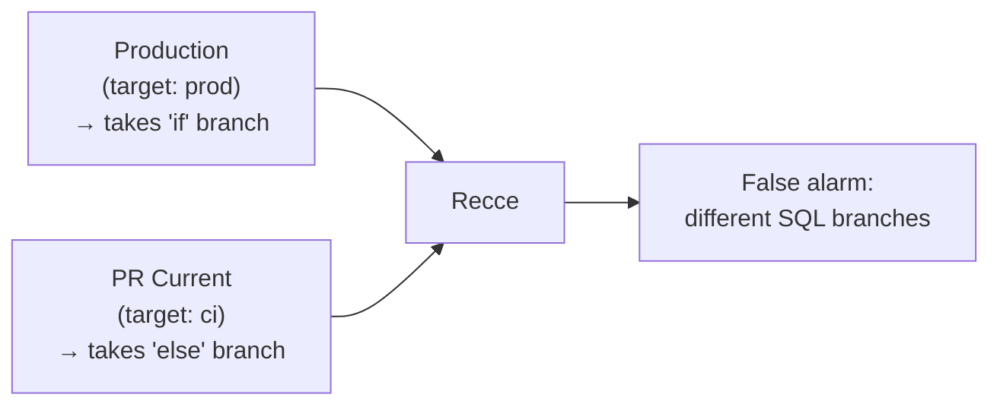
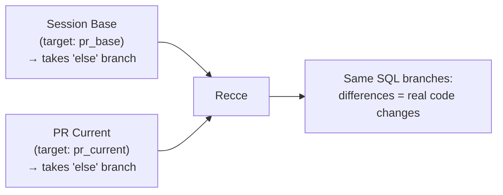

# Advanced Environment Setup

When comparing production (built with `target.name = 'prod'`) against a PR (built with `target.name = 'ci'`), some models produce different SQL, leading to data differences that have nothing to do with your code changes. This guide explains why it happens and how to fix it.

## Prerequisite
- [x] Complete the [Environment Best Practices](environment-best-practices.md) guide first. This page is for teams that found environment-dependent SQL patterns using the diagnostic grep in that guide.

## Why False Alarms Happen

A **false alarm** is when Recce reports data differences between base and current that are caused by the environment setup, not by your actual code changes. For example, Recce shows 10,000 fewer rows in a model you never touched, or flags a column value change on every single row. These differences are real in the data, but they don't reflect the impact of your PR.

This happens when dbt models contain **environment-dependent SQL**: patterns whose output depends on **when** or **where** the model is built, not just what code and data it consumes.

| Pattern | Example | Why It Causes False Alarms |
|---------|---------|---------------------------|
| `target.name` / `target.schema` | `` | Production takes the `if` branch, PR takes the `else` branch: different SQL |
| `current_date()` / `now()` | `WHERE date >= current_date() - 7` | Production was built yesterday, PR is built today: different date window |
| `current_timestamp()` | `SELECT current_timestamp() as updated_at` | Timestamp is always different between any two builds |
| Limited source data ranges | ` WHERE order_date >= ... ` | Production has all data, CI has a subset: row count differences unrelated to code |

When Recce compares production against your PR, these models produce literally different SQL, different output, false alarm.

!!! note "Incremental models are fine"
    Incremental models are **not** inherently problematic. In a fresh CI build, `is_incremental()` evaluates to `false` in both environments, so both run the same `else` branch. The real issue is environment-dependent patterns in **any** materialization type.

## The Fix: Session Base

Build both environments the same way. Instead of comparing production against the PR, build a dedicated **session base** for the PR using a CI target so both base and current produce the same SQL.

### Configure profiles.yml

Add `pr_base` and `pr_current` targets that mirror your CI target:

```yaml
# profiles.yml
jaffle_shop:
  outputs:
    pr_base:
      type: snowflake
      account: "{{ env_var('SNOWFLAKE_ACCOUNT') }}"
      user: "{{ env_var('SNOWFLAKE_USER') }}"
      password: "{{ env_var('SNOWFLAKE_PASSWORD') }}"
      database: analytics
      warehouse: COMPUTE_WH
      schema: "{{ env_var('SNOWFLAKE_SCHEMA_BASE') }}"
      threads: 4

    pr_current:
      type: snowflake
      account: "{{ env_var('SNOWFLAKE_ACCOUNT') }}"
      user: "{{ env_var('SNOWFLAKE_USER') }}"
      password: "{{ env_var('SNOWFLAKE_PASSWORD') }}"
      database: analytics
      warehouse: COMPUTE_WH
      schema: "{{ env_var('SNOWFLAKE_SCHEMA_CURRENT') }}"
      threads: 4
```

In your CI workflow, set both schemas per PR:

```yaml
env:
  SNOWFLAKE_SCHEMA_BASE: "pr_${{ github.event.pull_request.number }}_base"
  SNOWFLAKE_SCHEMA_CURRENT: "pr_${{ github.event.pull_request.number }}"
```

Both targets share the same `target.name` behavior, so both produce the same SQL.

**Before: Shared Production Base**



**After: Session Base for the PR**



### What Changes in CI

Instead of one build, you run **two builds** per PR:

1. **Session base**: checkout the merge base commit (where PR branched from main), build with `--target pr_base`
2. **Current**: checkout the PR branch, build with `--target pr_current`

Both use CI targets, so `target.name`, `current_date()`, etc. resolve the same way. Differences reflect actual code changes only.

!!! info "Why merge base, not tip of main?"
    If main has moved forward since the PR was created (other PRs merged), building from tip of main would include unrelated changes. The merge base isolates **this PR's changes only**, matching how GitHub computes its PR diff.

## Optimization: Reduce Data with --sample

Running dbt twice per PR means more warehouse compute and longer CI times. dbt's native `--sample` flag (dbt >= 1.10) injects time-based filters on source tables, so both base and current process the same data window. Faster builds, same comparison accuracy.

```bash
# Adjust dates to match your data range — both builds must use the same window
dbt build --target pr_base    --sample="{'start': '2025-02-01', 'end': '2025-02-28'}"
dbt build --target pr_current --sample="{'start': '2025-02-01', 'end': '2025-02-28'}"
```

**Prerequisites:**

- dbt >= 1.10
- `event_time` configured on source tables you want to sample

!!! warning "Always use absolute date ranges"
    Relative dates like `--sample="14 days"` use `CURRENT_TIMESTAMP`, which shifts between builds, reintroducing the exact environment-dependency you're trying to avoid.

## Optimization: Clone + Selective Rebuild

Instead of building everything twice, clone production and only rebuild the environment-dependent models:

1. `dbt clone --state prod_artifacts/`: copies all models from prod into the `pr_base` schema (zero-copy on Snowflake/BigQuery/Databricks)
2. `dbt build --target pr_base --select tag:environment_dependent`: rebuilds only the flagged models

The deterministic models are already correct as clones. Only the environment-dependent ones need rebuilding with a CI target.

!!! tip "These levers stack"
    `--sample` reduces **how much data** per model. Clone + Selective Rebuild reduces **which models** to build. Combine them to minimize both dimensions of cost.

## CI Configuration Examples

### Scenario A: Shared Production Base (Simple)

For teams with no environment-dependent SQL patterns. See [Environment Best Practices](environment-best-practices.md).

### Scenario B: Session Base, Full Rebuild

For small projects (< 50 models) with environment-dependent SQL.

```yaml
env:
  PR_BRANCH: ${{ github.head_ref }}

steps:
  - name: Build Session Base (from merge base)
    run: |
      MERGE_BASE=$(git merge-base origin/main ${{ env.PR_BRANCH }})
      git checkout $MERGE_BASE
      dbt build --target pr_base
      dbt docs generate --target pr_base

  - name: Upload Session Base Artifacts to Recce Cloud
    run: recce-cloud upload --session-base
    env:
      GITHUB_TOKEN: ${{ secrets.GITHUB_TOKEN }}

  - name: Build PR Current
    run: |
      git checkout ${{ env.PR_BRANCH }}
      dbt build --target pr_current
      dbt docs generate --target pr_current

  - name: Upload Current Artifacts to Recce Cloud
    run: recce-cloud upload
    env:
      GITHUB_TOKEN: ${{ secrets.GITHUB_TOKEN }}
```

### Scenario C: Session Base, Optimized

For large projects: combines clone, selective rebuild, and data sampling.

```yaml
env:
  PR_BRANCH: ${{ github.head_ref }}

steps:
  - name: Fetch production artifacts
    run: |
      mkdir -p prod_artifacts/
      aws s3 cp s3://your-bucket/dbt-artifacts/manifest.json prod_artifacts/

  - name: Build Session Base (clone + selective rebuild)
    run: |
      MERGE_BASE=$(git merge-base origin/main ${{ env.PR_BRANCH }})
      git checkout $MERGE_BASE
      dbt clone --target pr_base --state prod_artifacts/
      # Adjust dates to match your data range
      dbt build --target pr_base --select tag:environment_dependent \
        --sample="{'start': '2025-02-01', 'end': '2025-02-28'}"
      dbt docs generate --target pr_base

  - name: Upload Session Base Artifacts to Recce Cloud
    run: recce-cloud upload --session-base
    env:
      GITHUB_TOKEN: ${{ secrets.GITHUB_TOKEN }}

  - name: Build PR Current
    run: |
      git checkout ${{ env.PR_BRANCH }}
      # Use the same date range as session base
      dbt build --target pr_current \
        --sample="{'start': '2025-02-01', 'end': '2025-02-28'}"
      dbt docs generate --target pr_current

  - name: Upload Current Artifacts to Recce Cloud
    run: recce-cloud upload
    env:
      GITHUB_TOKEN: ${{ secrets.GITHUB_TOKEN }}
```

## Next Steps

- [Data Developer Workflow](../using-recce/data-developer.md): Start validating changes as a data developer
- [Data Reviewer Workflow](../using-recce/data-reviewer.md): Review data changes from your team
- [Preset Checks](../collaboration/preset-checks.md): Configure automated validation checks
