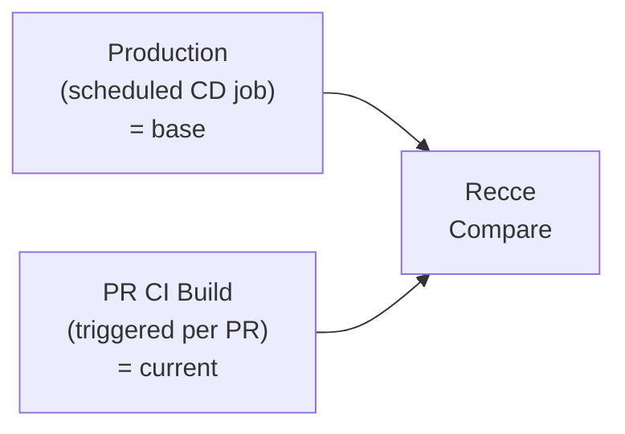

# Environment Best Practices

Recce compares a **base** environment (your production or staging reference) against a **current** environment (your PR changes). Reliable environments produce reliable validation results. When source data drifts, branches fall behind, or environments collide, Recce comparisons produce misleading results.

This guide walks you through preparing environments for accurate, efficient data validation, starting with the simplest setup and building up as needed.

## Start Simple: Shared Production Base

Most teams already have two environments running:

1. **Production**: your main branch, built on a schedule (CD job, dbt Cloud, Airflow, etc.)
2. **PR build**: a CI job triggered on each pull request that runs `dbt build`

The simplest Recce setup: use production as your base, and the PR build as your current.



!!! info
    This is where most teams should start. Production already exists, just point Recce at it. No extra builds, no extra configuration.

## Use Per-PR Schemas

Each PR should have its own isolated schema. This prevents interference between concurrent PRs and makes cleanup straightforward.

```yaml
# profiles.yml
ci:
  schema: "{{ env_var('CI_SCHEMA') }}"

# CI workflow
env:
  CI_SCHEMA: "pr_${{ github.event.pull_request.number }}"
```

Benefits:

- Complete isolation between PRs
- Parallel validation without conflicts
- Easy cleanup by dropping the schema

See [Environment Setup](environment-setup.md) for detailed configuration.

## Slim CI Works Out of the Box

Many teams optimize PR builds using dbt's slim CI pattern, only building models that changed and their downstream dependencies:

```bash
dbt build --select state:modified+ --defer --state prod-artifacts/
```

Unchanged models are resolved from production via `--defer`, so you only pay for what changed. Recce works with slim CI. It compares whatever was built in the PR environment against production.

For many projects, this is the complete setup.

## Keep Your Base Environment Current

The base environment can become outdated in two scenarios:

1. **New source data**: if you update data weekly, update the base environment at least weekly
2. **PRs merged to main**: the base no longer reflects the latest code

Configure your CD workflow to run:

- On merge to main (immediate update)
- On schedule (e.g., daily at 2 AM UTC)

See [Setup CD](setup-cd.md) for workflow configuration.

## Obtain Artifacts for Environments

Recce uses base and current environment artifacts (`manifest.json`, `catalog.json`) to find corresponding tables in the data warehouse for comparison.

- **Recce Cloud**: Automatic artifact management via `recce-cloud upload`. See [Setup CD](setup-cd.md) and [Setup CI](setup-ci.md).
- **dbt Cloud**: Download artifacts from dbt Cloud jobs. See [dbt Cloud Setup](dbt-cloud-setup.md).

For custom setups, upload artifacts to cloud storage (S3, GCS, Azure Blob) or use GitHub Actions artifacts.

## Keep PR Branch in Sync

If a PR runs after other PRs merge to main, the comparison mixes changes from the current PR with changes from other merged PRs. This produces results that don't accurately reflect the current PR's impact.

- **GitHub:** Enable [branch protection](https://docs.github.com/en/pull-requests/collaborating-with-pull-requests/proposing-changes-to-your-work-with-pull-requests/keeping-your-pull-request-in-sync-with-the-base-branch) to show when PRs are outdated.
- **CI check:** Add a workflow step to verify the PR is up-to-date:

```yaml
- name: Check if PR is up-to-date
  if: github.event_name == 'pull_request'
  run: |
    git fetch origin main
    UPSTREAM=${GITHUB_BASE_REF:-'main'}
    HEAD=${GITHUB_HEAD_REF:-${GITHUB_REF#refs/heads/}}
    if [ "$(git rev-list --left-only --count ${HEAD}...origin/${UPSTREAM})" -eq 0 ]; then
      echo "Branch is up-to-date"
    else
      echo "Branch is not up-to-date"
      exit 1
    fi
```

## Clean Up PR Environments

As PRs accumulate, so do generated schemas. Implement cleanup to manage warehouse storage.

**On PR close:** Create a workflow that drops the PR schema when the PR closes.

```sql




```

Run the cleanup:

```bash
dbt run-operation clear_schema --args "{'schema_name': 'pr_123'}"
```

**Scheduled cleanup:** Remove schemas not used for a week.

## Example Configuration

| Environment | Schema | When to Run | Count |
|-------------|--------|-------------|-------|
| Production | `public` | Daily | 1 |
| PR | `pr_<number>` | On push | # of open PRs |

## Seeing Unexpected Diffs?

If Recce shows large row count differences or data mismatches on models you didn't change, your project may contain **environment-dependent SQL**: patterns that produce different output depending on when or where models are built.

Common examples:

- **`target.name` / `target.schema`**: Jinja branches that behave differently in prod vs CI (e.g., ``)
- **`current_date()` / `current_timestamp()` / `now()`**: time-dependent filters that shift between builds
- **Limited source data ranges**: many teams filter sources to recent data in non-prod environments (e.g., ` WHERE order_date >= ... `). This is a common and sensible cost optimization, but it means production has all data while CI has a subset, producing row count differences unrelated to code changes.

Quick check: scan your project for these patterns:

```bash
grep -rn "target\.name\|target\.schema\|current_date\|current_timestamp\|now()" models/
```

- **No matches?** The shared production base setup above is all you need. You're done.
- **Matches found?** See [Advanced Environment Setup](environment-advanced.md) for strategies to eliminate false alarms.

## Next Steps

- [Environment Setup](environment-setup.md): Technical configuration for profiles.yml and CI/CD
- [Setup CD](setup-cd.md): Configure automatic baseline updates
- [Setup CI](setup-ci.md): Configure PR validation
- [Advanced Environment Setup](environment-advanced.md): Eliminate false alarms from environment-dependent SQL
