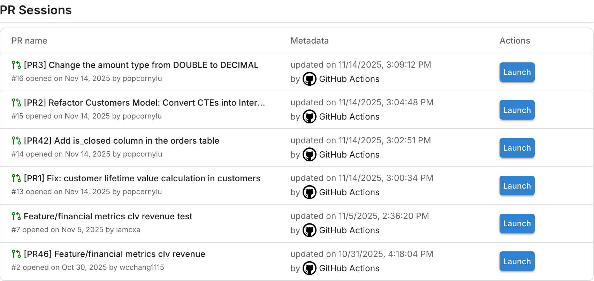
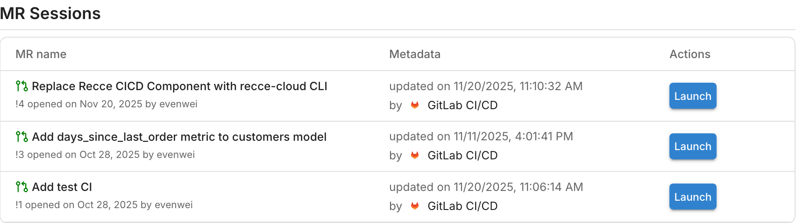

!!! tip "Following the onboarding guide?"
    Return to [Get Started with Recce Cloud](../getting-started/start-free-with-cloud.md#3-add-recce-to-cicd) after completing this page.

# Setup CI - Auto-Validate PRs

Manual data validation before merging is error-prone and slows down PR reviews. This guide shows you how to set up continuous integration (CI) that automatically validates data changes in every pull request (PR).

After completing this guide, your CI workflow validates every PR against your production baseline, with results appearing in Recce Cloud.

## What This Does

**Automated PR Validation** prevents data regressions before merge:

- **Triggers**: PR opened or updated against main
- **Action**: Auto-update Recce session for validation
- **Benefit**: Automated data validation and comparison visible in your PR

## Prerequisites

Before setting up CI, ensure you have:

- [x] **Cloud account** - [Start free trial](https://cloud.reccehq.com/)
- [x] **Repository connected** to Cloud - [Connect Git Provider](../getting-started/start-free-with-cloud.md#2-connect-git-provider)
- [x] **dbt artifacts** - Know how to generate `manifest.json` and `catalog.json` from your dbt project
- [x] **CD configured** - [Setup CD](setup-cd.md) to establish baseline for comparisons
- [x] **Environment configured** - [Environment Setup](environment-setup.md) with `ci` target for per-PR schemas

## Environment strategy

This workflow uses **per-PR schemas** with the `ci` target as the current environment. Each PR gets an isolated schema (e.g., `pr_123`) that compares against the base artifacts from CD.

See [Environment Setup](environment-setup.md) for profiles.yml configuration and why per-PR schemas are recommended.

## Setup

### GitHub Actions

Create `.github/workflows/pr-workflow.yml`:

```yaml linenums="1"
name: Validate PR Changes

on:
  pull_request:
    branches: ["main"]

concurrency:
  group: ${{ github.workflow }}-${{ github.ref }}
  cancel-in-progress: true

jobs:
  validate-changes:
    runs-on: ubuntu-latest
    timeout-minutes: 45
    permissions:
      contents: read
      pull-requests: write

    steps:
      - name: Checkout PR branch
        uses: actions/checkout@v4
        with:
          fetch-depth: 2

      - name: Setup Python
        uses: actions/setup-python@v5
        with:
          python-version: "3.11"
          cache: "pip"

      - name: Install dependencies
        run: pip install -r requirements.txt

      - name: Build current branch artifacts
        run: |
          dbt deps
          dbt build --target ci
          dbt docs generate --target ci
        env:
          SNOWFLAKE_ACCOUNT: ${{ secrets.SNOWFLAKE_ACCOUNT }}
          SNOWFLAKE_USER: ${{ secrets.SNOWFLAKE_USER }}
          SNOWFLAKE_PASSWORD: ${{ secrets.SNOWFLAKE_PASSWORD }}
          SNOWFLAKE_DATABASE: ${{ secrets.SNOWFLAKE_DATABASE }}
          SNOWFLAKE_WAREHOUSE: ${{ secrets.SNOWFLAKE_WAREHOUSE }}
          SNOWFLAKE_SCHEMA: "PR_${{ github.event.pull_request.number }}"

      - name: Upload to Recce Cloud
        run: |
          pip install recce-cloud
          recce-cloud upload
        env:
          GITHUB_TOKEN: ${{ secrets.GITHUB_TOKEN }}
```

**Key points:**

- Creates a per-PR schema (`PR_123`, `PR_456`, etc.) using the dynamic `SNOWFLAKE_SCHEMA` environment variable to isolate each PR's data
- `dbt build` and `dbt docs generate` create the required artifacts (`manifest.json` and `catalog.json`)
- `recce-cloud upload` (without `--type`) auto-detects this is a PR session
- [`GITHUB_TOKEN`](https://docs.github.com/en/actions/concepts/security/github_token) authenticates with Cloud

### GitLab CI/CD

Add to your `.gitlab-ci.yml`:

```yaml linenums="1" hl_lines="29-30"
stages:
  - build
  - upload

variables:
  DBT_TARGET: "ci"

# MR build - runs on merge requests
dbt-build:
  stage: build
  image: python:3.11-slim
  script:
    - pip install -r requirements.txt
    - dbt deps
    # Optional: dbt build --target $DBT_TARGET
    - dbt docs generate --target $DBT_TARGET
  artifacts:
    paths:
      - target/
    expire_in: 1 week
  rules:
    - if: $CI_PIPELINE_SOURCE == "merge_request_event"

# Upload to Recce Cloud
recce-upload:
  stage: upload
  image: python:3.11-slim
  script:
    - pip install recce-cloud
    - recce-cloud upload
  dependencies:
    - dbt-build
  rules:
    - if: $CI_PIPELINE_SOURCE == "merge_request_event"
```

**Key points:**

- Authentication is automatic via `CI_JOB_TOKEN`
- `recce-cloud upload` (without `--type`) auto-detects this is an MR session
- `dbt docs generate` creates the required `manifest.json` and `catalog.json`

### Platform Comparison

| Aspect               | GitHub Actions                      | GitLab CI/CD                                       |
| -------------------- | ----------------------------------- | -------------------------------------------------- |
| **Config file**      | `.github/workflows/pr-workflow.yml` | `.gitlab-ci.yml`                                   |
| **Trigger**          | `on: pull_request:`                 | `if: $CI_PIPELINE_SOURCE == "merge_request_event"` |
| **Authentication**   | Explicit (`GITHUB_TOKEN`)           | Automatic (`CI_JOB_TOKEN`)                         |
| **Session type**     | Auto-detected from PR context       | Auto-detected from MR context                      |
| **Artifact passing** | Not needed (single job)             | Use `artifacts:` + `dependencies:`                 |

## Verification

### Test with a PR

**GitHub:**

1. Create a test PR with small data changes
2. Check **Actions** tab for CI workflow execution
3. Verify validation runs successfully

**GitLab:**

1. Create a test MR with small data changes
2. Check **CI/CD → Pipelines** for workflow execution
3. Verify validation runs successfully

### Verify Success

Look for these indicators:

- [x] **Workflow/Pipeline completes** without errors
- [x] **PR session created** in [Cloud](https://cloud.reccehq.com)
- [x] **Session URL** appears in workflow/pipeline output

**GitHub:**

{: .shadow}

**GitLab:**

{: .shadow}

### Expected Output

When the upload succeeds, you'll see output like this in your workflow logs:

**GitHub:**

```hl_lines="2 5 16"
─────────────────────────── CI Environment Detection ───────────────────────────
Platform: github-actions
PR Number: 42
PR URL: https://github.com/your-org/your-repo/pull/42
Session Type: cr
Commit SHA: abc123de...
Base Branch: main
Source Branch: feature/your-feature
Repository: your-org/your-repo
Info: Using GITHUB_TOKEN for platform-specific authentication
────────────────────────── Creating/touching session ───────────────────────────
Session ID: f8b0f7ca-ea59-411d-abd8-88b80b9f87ad
Uploading manifest from path "target/manifest.json"
Uploading catalog from path "target/catalog.json"
Notifying upload completion...
──────────────────────────── Uploaded Successfully ─────────────────────────────
Uploaded dbt artifacts to Recce Cloud for session ID "f8b0f7ca-ea59-411d-abd8-88b80b9f87ad"
Artifacts from: "/home/runner/work/your-repo/your-repo/target"
Change request: https://github.com/your-org/your-repo/pull/42
```

**GitLab:**

```hl_lines="2 5 16"
─────────────────────────── CI Environment Detection ───────────────────────────
Platform: gitlab-ci
MR Number: 4
MR URL: https://gitlab.com/your-org/your-project/-/merge_requests/4
Session Type: cr
Commit SHA: c928e3d5...
Base Branch: main
Source Branch: feature/your-feature
Repository: your-org/your-project
Info: Using CI_JOB_TOKEN for platform-specific authentication
────────────────────────── Creating/touching session ───────────────────────────
Session ID: f8b0f7ca-ea59-411d-abd8-88b80b9f87ad
Uploading manifest from path "target/manifest.json"
Uploading catalog from path "target/catalog.json"
Notifying upload completion...
──────────────────────────── Uploaded Successfully ─────────────────────────────
Uploaded dbt artifacts to Recce Cloud for session ID "f8b0f7ca-ea59-411d-abd8-88b80b9f87ad"
Artifacts from: "/builds/your-org/your-project/target"
Change request: https://gitlab.com/your-org/your-project/-/merge_requests/4
```

### Review PR Session

To analyze the changes in detail:

1. Go to your [Cloud](https://cloud.reccehq.com)
2. Find the PR session that was created
3. Launch Recce instance to explore data differences

## Advanced Options

### Custom Artifact Path

If your dbt artifacts are in a non-standard location:

```bash
recce-cloud upload --target-path custom-target
```

### Dry Run Testing

Test your configuration without actually uploading:

```bash
recce-cloud upload --dry-run
```

## Troubleshooting

If CI is not working, the issue is likely in your CD setup. Most problems are shared between CI and CD:

**Common issues:**

- Missing dbt artifacts
- Authentication failures
- Upload errors
- Sessions not appearing

**→ See the [Setup CD Troubleshooting section](setup-cd.md#troubleshooting)** for detailed solutions.

**CI-specific tip:** If CD works but CI doesn't, verify:

1. PR trigger conditions in your workflow configuration
2. The PR is targeting the correct base branch (usually `main`)
3. You're looking at PR sessions in Cloud (not production sessions)

## Next Steps

After setting up CI, explore these guides:

- [Environment Best Practices](environment-best-practices.md) - Strategies for source data and schema management
- [Get Started with Cloud](../getting-started/start-free-with-cloud.md) - Complete onboarding guide
