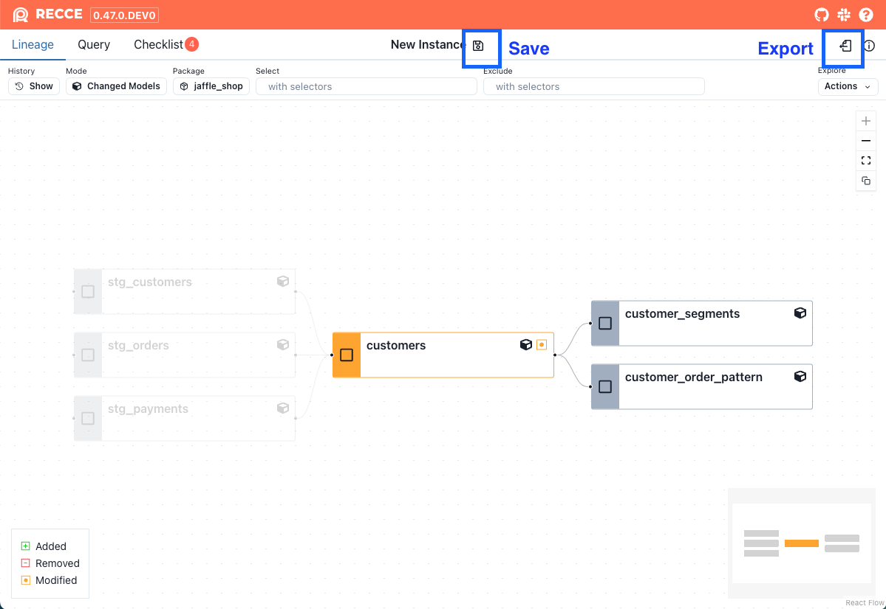
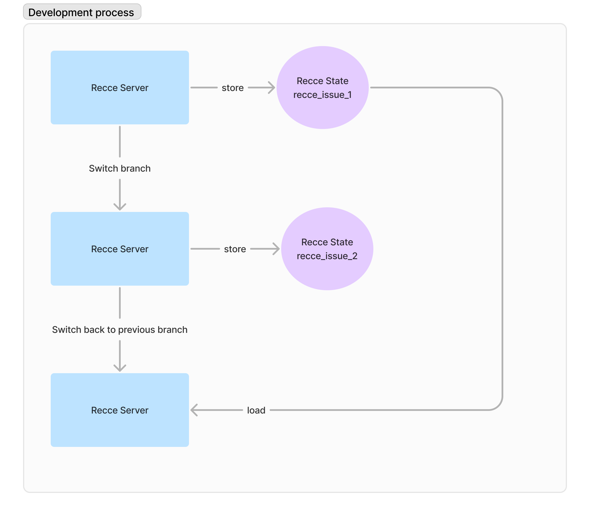
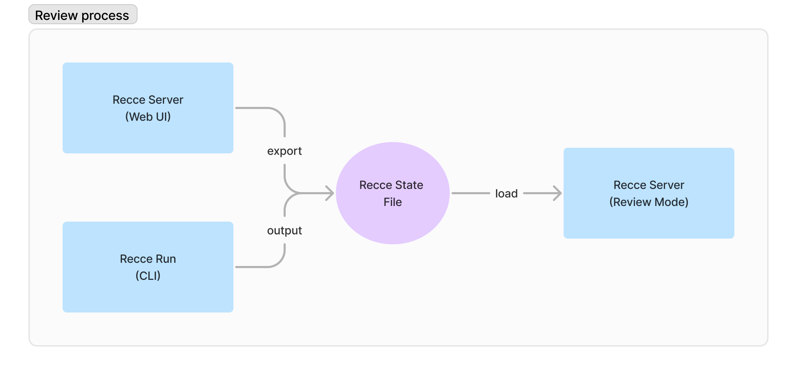

# State File

This reference documents the Recce state file format, which stores validation results, checks, and environment information.

## Overview

The state file represents the serialized state of a Recce instance. It is a JSON-formatted file containing checks, runs, environment artifacts, and runtime information.

## File Format

| Aspect | Details |
|--------|---------|
| Format | JSON |
| Default name | `recce_state.json` |
| Location | dbt project root |

## Contents

The state file contains the following information:

- **Checks**: Data from the checks added to the checklist on the Checklist page
- **Runs**: Each diff execution in Recce corresponds to a run, similar to a query in a data warehouse. Typically, a single run submits a series of queries to the warehouse and retrieves the final results
- **Environment Artifacts**: Includes `manifest.json` and `catalog.json` files for both the base and current environments
- **Runtime Information**: Metadata such as Git branch details and pull request (PR) information from the CI runner

## Saving the State File

There are multiple ways to save the state file.

### Save from Web UI

Click the **Save** button at the top of the app. Recce will continuously write updates to the state file, effectively working like an auto-save feature, and persist the state until the Recce instance is closed. The file is saved with the specified filename in the directory where the `recce server` command is run.

### Export from Web UI

Click the **Export** button located in the top-right corner to download the current Recce state to any location on your machine.

{: .shadow}

### Start with State File

Provide a state file as an argument when launching Recce. If the file does not exist, Recce will create a state file and start with an empty state. If the file exists, Recce will load the state and continue working from it.

```bash
recce server my_recce_state.json
```

## Using the State File

The state file can be used in several ways:

### Continue State

Launch Recce with the specified state file to continue from where you left off.

```bash
recce server my_recce_state.json
```

### Review Mode

Running Recce with the `--review` option enables review mode. In this mode, Recce uses the dbt artifacts in the state file instead of those in the `target/` and `target-base/` directories. This option is useful for distinguishing between development and review purposes.

```bash
recce server --review my_recce_state.json
```

### Import Checklist

To preserve favorite checks across different branches, import a checklist by clicking the **Import** button at the top of the checklist.

### Continue from `recce run`

Execute the checks in the specified state file.

```bash
recce run --state-file my_recce_state.json
```

## Workflow Examples

### Development Workflow

In the development workflow, the state file acts as a session for developing a feature. It allows you to store checks to verify the diff results against the base environment.

1. Run the recce server without a state file

    ```bash
    recce server
    ```

2. Add checks to the checklist
3. Save the state by clicking the **Save** or **Export** button
4. Resume your session by launching Recce with the specific state file

    ```bash
    recce server recce_issue_1.json
    ```



### PR Review Workflow

During the PR review process, the state file serves as a communication medium between the submitter and the reviewer.

1. Start the Recce server without a state file

    ```bash
    recce server
    ```

2. Add checks to the checklist
3. Save the state by clicking the **Save** or **Export** button
4. Share the state file with the reviewer or attach it as a comment in the pull request
5. The reviewer reviews the results using the state file

    ```bash
    recce server --review recce_issue_1.json
    ```



## CLI Options

| Option | Description |
|--------|-------------|
| `recce server <file>` | Start server with state file |
| `recce server --review <file>` | Start in review mode using state file artifacts |
| `recce run --state-file <file>` | Run checks from state file |

## Default Behavior

- If no state file is specified, Recce starts with an empty state
- State files are saved to the current working directory by default
- Review mode (`--review`) uses artifacts embedded in the state file

## Related

- [CLI Commands](../using-recce/cli-commands.md) - Command-line options
- [Configuration](./configuration.md) - Preset check configuration
- [PR Review Workflow](../using-recce/oss-workflow.md) - Using state files in reviews
