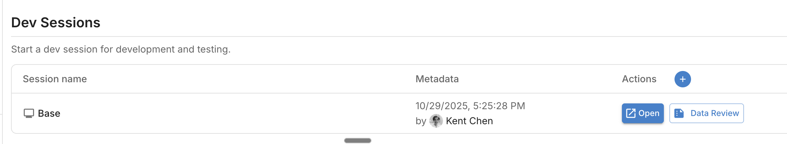
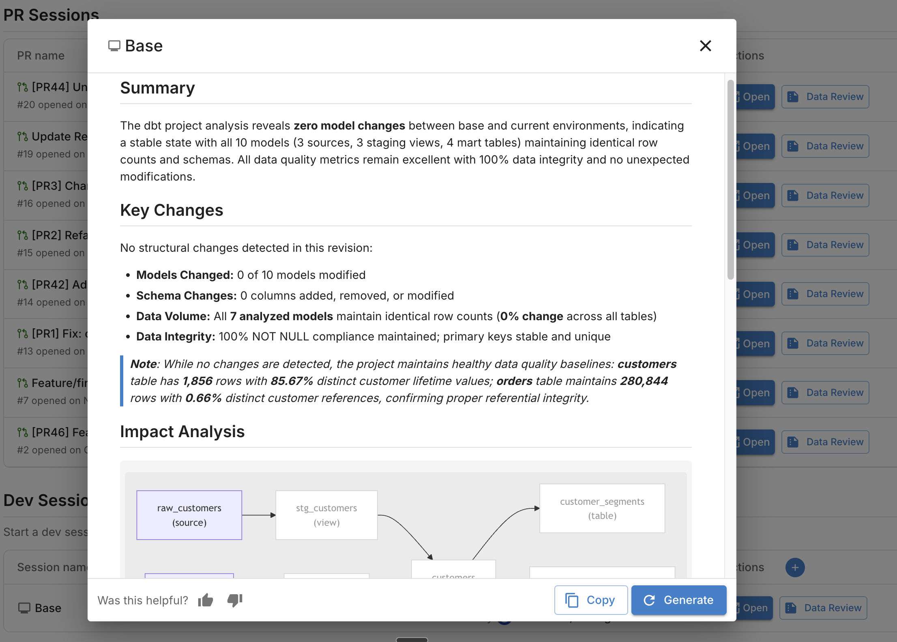

# Data Developer Workflow

Validate data changes throughout your development lifecycle. This guide covers validating changes before creating a PR (dev sessions) and iterating on feedback after your PR is open.

**Goal:** Validate data changes at every stage of development, from local work through PR merge.

## Prerequisites

- [x] Recce Cloud account
- [x] dbt project with CI/CD configured for Recce
- [x] Access to your data warehouse

## Development Stages

### Before PR: Dev Sessions

Validate changes locally before pushing to remote. Dev sessions let you run Recce validation without creating a PR. Since your CD workflow automatically maintains the base environment, you just upload your local `target/` artifacts as the current environment to compare against production.

#### When to Use Dev Sessions

- Testing changes before committing
- Validating complex refactoring locally
- Exploring impact without creating a PR
- Sharing work-in-progress with teammates

#### Upload via Web UI

1. Go to [Cloud](https://cloud.reccehq.com)
2. Navigate to your project
3. Click **New Dev Session**
4. Upload your dbt artifacts:
    - `target/manifest.json`
    - `target/catalog.json`

**Expected result:** Dev session created. Recce validates your changes against the production base.

{: .shadow}

#### Upload via CLI

Run from your dbt project directory:

```bash
recce-cloud upload --type dev
```

This uploads your current `target/` artifacts and creates a dev session.

**Required files:**

| File | Location | Generated by |
|------|----------|--------------|
| `manifest.json` | `target/` | `dbt run`, `dbt build`, or `dbt compile` |
| `catalog.json` | `target/` | `dbt docs generate` |

#### Review Your Changes

After uploading, you can review your changes in Cloud:

1. **Trigger agent review** - Click **Data Review** to generate a summary of your changes
2. **Read the summary** - The agent analyzes impact, runs validation checks, and explains what changed
3. **Launch Recce instance** - Click **Launch Recce** to explore lineage, run data diffs, and investigate deeper

{: .shadow}  

### After PR: CI/CD Validation

Once you push changes and open a PR, the Recce Agent validates automatically.

#### What Happens

1. Your CI pipeline runs `recce-cloud upload`
2. The agent compares your PR branch against the base branch
3. The agent runs validation checks based on detected changes
4. A data review summary posts to your PR

#### Understanding the Agent Summary

The summary shows key changes, impact analysis, checklist results, and suggested actions. See [Reading the Summary](../what-you-can-explore/summary.md#reading-the-summary) for details.

#### Fixing Issues

When the agent identifies issues:

1. Review the validation results in the PR comment
2. Click **Launch Recce** to explore details in the web UI
3. Identify the root cause using lineage and data diffs
4. Make fixes in your branch
5. Push changes - the agent re-validates automatically

#### Iterating Until Checks Pass

Each push triggers a new validation cycle:

1. Agent re-analyzes your changes
2. New validation results post to the PR
3. Previous results are updated (not duplicated)
4. Continue until all checks pass

## Validation Techniques

### Check Lineage First

Start with [lineage diff](../what-you-can-explore/lineage-diff.md) to understand your change scope:

- Modified models highlighted in the DAG
- Downstream impact visible at a glance
- Schema changes shown per model

### Validate Metadata

Low-cost checks using model metadata. See [Data Diffing](../what-you-can-explore/data-diffing.md) for details:

- **Schema diff** - Column additions, removals, type changes
- **Row count diff** - Record count comparison (uses warehouse metadata)

### Validate Data

Higher-cost checks that query your warehouse:

- **Value diff** - Column-level match percentage
- **Profile diff** - Statistical comparison (count, distinct, min, max, avg)
- **Histogram diff** - Distribution changes for numeric columns
- **Top-K diff** - Distribution changes for categorical columns

### Custom Queries

For flexible validation, use query diff:

```sql
SELECT
    date_trunc('month', order_date) AS month,
    SUM(amount) AS revenue
FROM {{ ref('orders') }}
GROUP BY month
ORDER BY month DESC
```

Add queries to your checklist for repeated use.

### Add to Checklist

After running validation checks, add them to your checklist for reviewers:

1. Run a validation (row count, profile, value diff, etc.)
2. Click **Add to Checklist** to save the result
3. Add a description explaining what the check validates and what reviewers should look for

Write clear descriptions that help reviewers understand:

- **What changed** - The specific model or column being validated
- **Why it matters** - Business context or downstream impact
- **What to verify** - Expected behavior or acceptable thresholds

Good descriptions reduce back-and-forth and speed up PR approval. See [Checklist](../collaboration/checklist.md) for more details.

## Verification

Confirm your workflow works:

**Before PR:**

1. Make a small model change locally
2. Generate artifacts: `dbt build && dbt docs generate`
3. Upload dev session: `recce-cloud upload --type dev`
4. Verify session appears in Cloud
5. Launch Recce to explore changes, or click **Data Review** to trigger agent validation
6. Iterate on your changes until validation passes

**After PR:**

1. Create PR and confirm agent posts summary
2. Launch Recce and add validation checks to checklist
3. Push a fix and confirm agent re-validates
4. Confirm reviewers can approve checks

## Troubleshooting

| Issue | Solution |
|-------|----------|
| Dev session upload fails | Check artifacts exist in `target/`; run `dbt docs generate` |
| Agent doesn't run on PR | Verify CI workflow includes `recce-cloud upload` |
| Validation results missing | Check warehouse credentials in CI secrets |
| Summary not appearing | Confirm `GITHUB_TOKEN` has PR write permissions |

## Next Steps

- [Data Reviewer Workflow](data-reviewer.md) - How reviewers use Recce
- [Admin Setup](admin-setup.md) - Set up your organization
- [Data Review Summary](../what-you-can-explore/summary.md) - Understanding agent summaries
