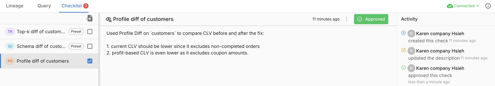
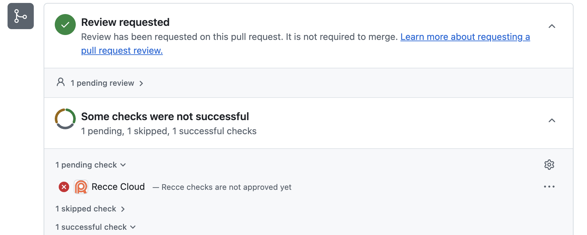

# Data Reviewer Workflow

Review data changes in pull requests using Recce. Your admin set up Recce for your team - here's how to use it as a reviewer.

**Goal:** Review and approve data changes in PRs with confidence.

## Prerequisites

- [x] Recce Cloud account (via team invitation)
- [x] Access to the project in Cloud
- [x] PR with Recce validation results

## Reviewing a PR

### 1. Find the Data Review Summary

When a PR modifies dbt models, the Recce Agent posts a summary comment. See [Data Review Summary](../what-you-can-explore/summary.md) for details on what the agent analyzes.

1. Open the PR in GitHub/GitLab
2. Scroll to the Recce bot comment
3. Review the summary sections

**Expected result:** Summary shows change overview, impact analysis, and validation results.

### 2. Understand the Summary

The summary shows key changes, impact analysis, checklist results, and suggested actions. See [Reading the Summary](../what-you-can-explore/summary.md#reading-the-summary) for details.

### 3. Review the Checklist

Verify the checklist covers the impacts identified in the summary. Check each validation result for Pass, Warning, or Fail status. If impacted models lack validation checks, consider running additional diffs in Cloud.

Approve individual checks as you review them to track your progress and signal to other reviewers which validations have been verified.

{: .shadow}

#### Activity

Alongside the checklist, use the [Activity](../collaboration/activity.md) panel to track all session events—approvals, comments, and updates. Leave comments, request clarifications, or discuss specific validation results directly in the session.

### 4. Explore in Cloud

For deeper investigation:

1. Click **Launch Recce** in the PR comment (or go to Cloud)
2. Select the PR session from the list
3. Explore the changes interactively

**What you can do:**

- View [lineage diff](../what-you-can-explore/lineage-diff.md) to see affected models
- Drill into schema changes per model
- Run additional [data diffs](../what-you-can-explore/data-diffing.md) (row count, profile, value, etc.)
- Execute custom queries to investigate specific concerns

### 5. Approve or Request Changes

Based on your review:

**Approve the PR:**

- Validation results meet expectations
- Impact scope is understood and acceptable
- No unexpected data changes

**Request changes:**

- Validation failures need investigation
- Impact scope is broader than expected
- Questions about specific changes

#### PR Blocking Checks

Recce checks appear as status checks on your PR. When configured as required checks, reviewers must approve all checks in the checklist before the PR can be merged.

{: .shadow}

## Common Review Scenarios

### Schema Changes

When columns are added, removed, or modified:

1. Check if downstream models are affected
2. Verify the change is intentional
3. Confirm breaking changes are coordinated

### Row Count Differences

When record counts change:

1. Determine if the change is expected
2. Check if filters or joins were modified
3. Verify the magnitude is reasonable

### Performance Impact

When models are refactored:

1. Compare query complexity
2. Check for unintended full table scans
3. Review impact on downstream refresh times

## Verification

Confirm you can review PRs:

1. Open a PR with Recce validation results
2. Find the Recce bot comment
3. Click Launch Recce to open the session
4. Navigate the lineage and view a diff result

## Next Steps

- [Data Developer Workflow](data-developer.md) - How developers validate changes
- [Data Review Summary](../what-you-can-explore/summary.md) - Understanding the agent summary
- [Checklist](../collaboration/checklist.md) - Track validation checks across PRs
- [Share Validation Results](../collaboration/share.md) - Share findings with your team
