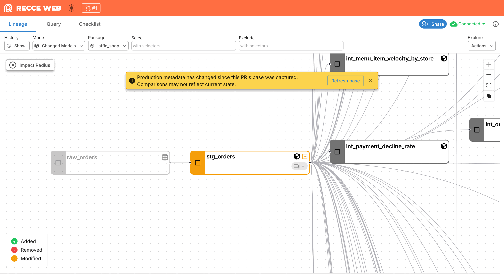

# Refresh Base

Recce Cloud captures a snapshot of the shared production base into each PR session at upload time. Comparisons in that session run against the frozen snapshot, so the diff stays focused on **only what this PR changed** — even when other PRs merge to `main` afterwards.

When production moves on, a yellow banner appears at the top of the session offering a one-click **Refresh base** action:

{: .shadow}

Click **Refresh base** only when you want to re-anchor the comparison to current production. Dismissing the banner with **×** hides it but doesn't refresh the comparison — the diff stays anchored to the old snapshot until you click **Refresh base**.

## Why the Diff Is Frozen

Without a frozen snapshot, every comparison would run against whichever production state is live when you open the UI. If `main` has merged ten times since CI ran, those merges leak into the diff as phantom changes — modified models you never touched, removed models that exist only because production has progressed.

The frozen snapshot keeps the diff anchored to the production state that existed when this PR was first validated, so the only changes you see come from this branch.

!!! info "Example"
    Before this feature, a PR that modified one model could surface as **2 modified + 13 removed** because production had drifted between CI and review. With the frozen snapshot, the same PR surfaces as **1 modified, 0 removed** — matching what the developer actually changed.

## What Refresh Base Does

Clicking **Refresh base** re-anchors this PR session to the current shared base:

1. The button shows a spinner while the refresh runs (about 30 seconds for typical projects).
2. The lineage and diff views re-render against the new baseline.
3. A toast confirms the refresh:

    > Base refreshed. If you've saved checks in this session, you may want to re-run them against the new base.

If the refresh fails, the banner stays visible and an error toast appears.

!!! tip "Re-run saved checks after a refresh"
    Saved checks still reference the previous baseline. Re-run them so the recorded results reflect the new comparison.

## When to Refresh

| Situation | Recommended action |
|-----------|---------------------|
| You only care about what this PR changed | Leave the banner; the frozen snapshot is already correct |
| You want to validate the PR against current production (e.g., right before merging) | Click **Refresh base** |
| The developer pushed new commits after the banner appeared | CI re-uploads automatically and captures a fresh snapshot — no manual refresh needed |

For most reviews, the frozen snapshot is the right default — it answers *"what does this PR change?"* without interference from unrelated merges.

## Requirements

Your project needs a shared base configured (`recce-cloud upload --type prod` running on `main`). The banner and **Refresh base** action are only available when a shared base exists.

## Related Reading

- [Environment Best Practices](../setup-guides/environment-best-practices.md): How the shared base is built and kept current.
- [Data Reviewer Workflow](data-reviewer.md): The full review flow this banner appears in.
- [Data Developer Workflow](data-developer.md): How PR uploads capture the snapshot in CI.
