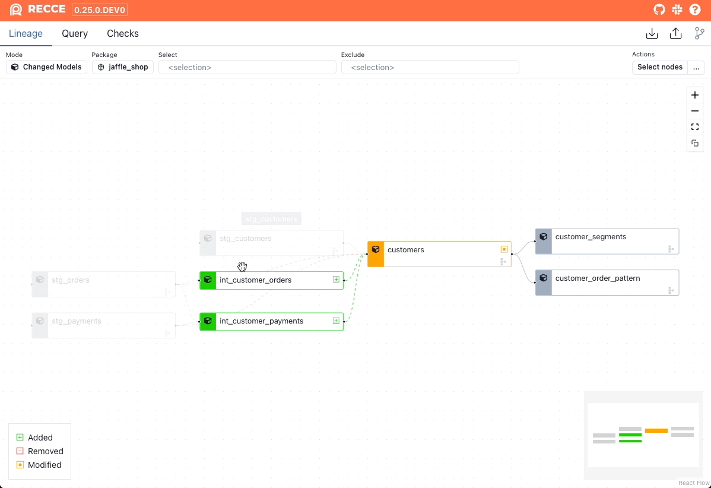
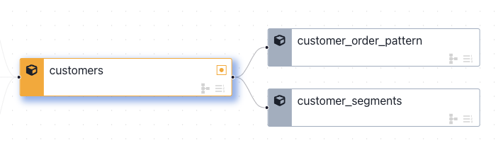
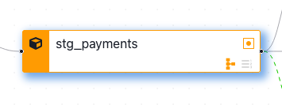
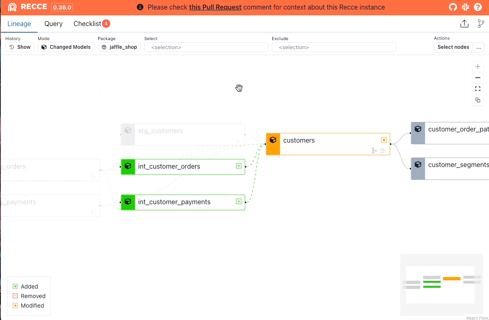
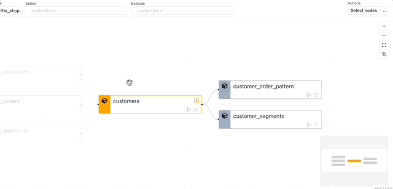
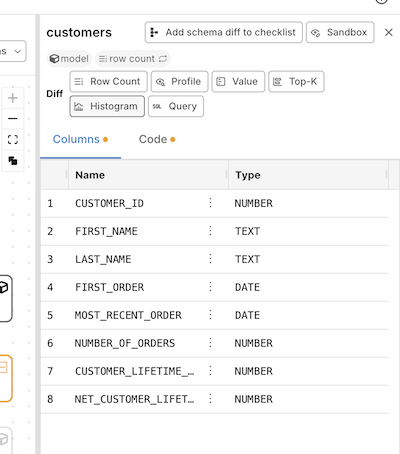
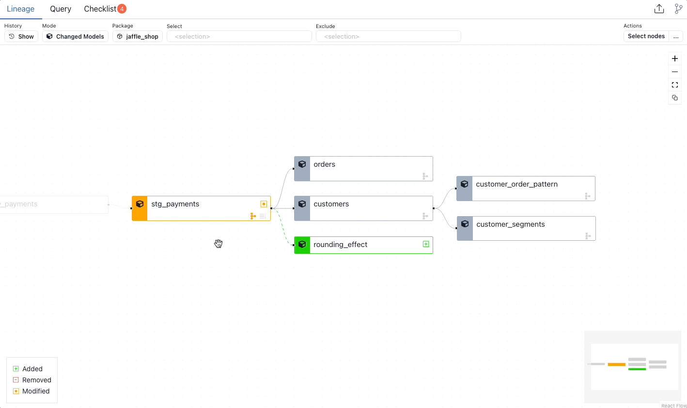

# Lineage Diff

The Lineage view shows how your data model changes impact your data pipeline. It visualizes the potential area of impact from your modifications, helping you determine which models need further investigation.

## How It Works

Recce compares your base and current branch artifacts to identify:

- **Dependencies** - Which models depend on others
- **Change Impact** - How modifications ripple through your pipeline
- **Data Flow** - The path data takes from sources to final outputs

<figure markdown>
  {: .shadow}
  <figcaption>Interactive lineage graph showing modified models</figcaption>
</figure>

### Visual Status Indicators

Models are color-coded to indicate their status:

| Color | Status |
|-------|--------|
| **Green** | Added (new to your project) |
| **Red** | Removed (deleted from your project) |
| **Orange** | Modified (changed code or configuration) |
| **Gray** | Unchanged (shown for context) |

<figure markdown>
  {: .shadow}
  <figcaption>Model node with status indicators</figcaption>
</figure>

### Change Detection Icons

Each model displays icons in the bottom-right corner:

- **Row Count Icon** - Shows when row count differences are detected
- **Schema Icon** - Shows when column or data type changes are detected

Grayed-out icons indicate no changes were detected.

<figure markdown>
  {: .shadow}
  <figcaption>Model with schema change detected</figcaption>
</figure>

## Filtering and Selection

### Filter Options

In the top control bar:

| Filter | Description |
|--------|-------------|
| **Mode** | Changed Models (modified + downstream) or All |
| **Package** | Filter by dbt package names |
| **Select** | Select nodes by [node selection](multi-models.md) |
| **Exclude** | Exclude nodes by [node selection](multi-models.md) |

### Selecting Models

Click a node to select it, or use **Select nodes** to select multiple models for batch operations.

### Row Count Diff by Selector

Run row count diff on selected nodes:

1. Use `select` and `exclude` to filter nodes
2. Click the **...** button in the top-right corner
3. Click **Row Count Diff by Selector**

{: .shadow}

## Investigating Changes

### Node Details Panel

Click any model to open the node details panel:

<figure markdown>
  {: .shadow}
  <figcaption>Open the node details panel</figcaption>
</figure>

From this panel you can:

- View model metadata (type, materialization)
- Examine schema changes
- Run validation checks
- Add findings to your checklist

### Available Validations

Click **Explore Change** to access:

- [Row Count Diff](data-diffing.md#row-count-diff) - Compare record counts
- [Profile Diff](data-diffing.md#profile-diff) - Analyze column statistics
- [Value Diff](data-diffing.md#value-diff) - Identify specific value changes
- [Top-K Diff](data-diffing.md#top-k-diff) - Compare common values
- [Histogram Diff](data-diffing.md#histogram-diff) - Visualize distributions

<figure markdown>
  {: .shadow}
  <figcaption>Node details with exploration options</figcaption>
</figure>

## Schema Diff

Schema diff identifies structural changes to your models:

- **Added columns** - New fields (shown in green)
- **Removed columns** - Deleted fields (shown in red)
- **Renamed columns** - Changed names (shown with arrows)
- **Data type changes** - Modified column types

<figure markdown>
  {: .shadow}
  <figcaption>Interactive schema diff showing column changes</figcaption>
</figure>

!!! warning "Requirements"
    Schema diff requires `catalog.json` in both environments. Run `dbt docs generate` in both before starting your Recce session.

## When to Use

- **Starting your review** - Get an overview of all changes and their downstream impact
- **Identifying affected models** - Find models that need validation
- **Understanding dependencies** - See how changes propagate through your pipeline
- **Scoping your validation** - Determine which models to diff

## Related

- [Validation Techniques](../using-recce/data-developer.md#validation-techniques) - How to use lineage in your workflow
- [Code Change](code-change.md) - View SQL changes for a model
- [Column-Level Lineage](column-level-lineage.md) - Trace column dependencies
- [Multi-Model Selection](multi-models.md) - Batch operations on models
- [Data Diffing](data-diffing.md) - Validate data changes
